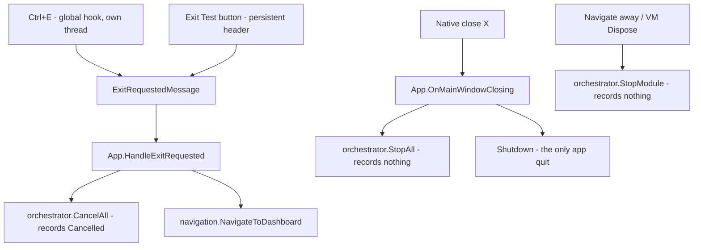

# Exit and Navigation

Architecture §6. **The strongest design decision in the product: a mouse-only path
and a keyboard-only path are each independently sufficient to leave any screen.**
Preserve this through any refactor.

## The four exit paths



**Exit semantics (roadmap Phase 2, decision D1 — landed):** leaving a test is a
non-event. `TestOrchestrator.StopModule`/`StopAll` stop the module and **remove
the appended `Running` result from the session**, so an opened-but-left module
reads as `Not run` with no finding. Only a deliberate abort — `Ctrl+E` or the
header **Exit Test** button, both via `ExitRequestedMessage` → `CancelAll` —
records `Cancelled`. The CPU-stress **Stop** button is a third, deliberate
ending: `CpuStressModule.CompleteEarly()` resolves `Passed` with a finding
stating the achieved duration.

**Critical distinction:** `Ctrl+E` and the header **Exit Test** button **do not
quit the app**. They abort the running module (recording `Cancelled`) and return
to the dashboard. Only the native window close ends the process — and it now
records nothing (`StopAll`).

```csharp
// App.HandleExitRequested
if (orchestrator.CurrentExclusiveModule is not null || orchestrator.RunningModules.Count > 0)
{
    orchestrator.CancelAll();
}
navigation.NavigateToDashboard();
```

The subscription lives on `App`, not on any view, so the handler runs regardless of
which screen is active — including from the fullscreen pattern window, which has no
normal chrome.

## Why Ctrl+E has its own thread

`WH_KEYBOARD_LL` callbacks run on the thread that installed the hook, and that
thread must keep pumping messages for the hook to fire at all. A starved or
blocked callback risks being skipped — independently of whether the UI appears
frozen. `ExitHotkeyService` therefore installs the hook on a **dedicated
background thread with a minimal message loop**, so exit responsiveness is
decoupled from whatever the WPF dispatcher is doing.

This is why the CPU stress workers run at `ThreadPriority.BelowNormal`: every core
still gets loaded (the point of a burn-in) while the OS continues to favour the UI
and hook threads under contention.

## Esc is deliberately asymmetric

- **Everywhere else:** `Esc` triggers "Exit test? Unsaved measurements will be lost."
- **In the keyboard module:** `Esc` is ordinary test data — just another key to
  register — and carries no exit meaning. The operator must be able to verify the
  `Esc` key works.

`Ctrl+E` still exits during raw keyboard capture, because the hook is independent
of the module's raw-input registration.

## The pattern window exception

The monitor pattern screen needs true edge-to-edge fullscreen for accurate colour
testing, so it has no native chrome. It relies on:

- the **auto-hiding** overlay panel (collapses after 3s of no mouse movement,
  reappears on `MouseMove`), and
- `Ctrl+E`.

It carries **one** button:

| Button | Action | Recorded result |
|---|---|---|
| Back to controls | `Close()` | nothing — the module reads as `Not run` when the monitor screen is left |
| Ctrl+E (keyboard-only) | `ExitRequestedMessage` | **`Cancelled`** |

The mouse-only "Back to controls" and the keyboard-only `Ctrl+E` are each
independently sufficient to leave.

## Navigation and disposal

`NavigationService` is view-model-first navigation over the
`ModuleScreenRegistry` (roadmap E1): one `moduleId → view-model factory` table
built in the DI composition root. Plus one critical rule:

```csharp
private void SetScreen(object screen)
{
    if (_shell.CurrentScreen is IDisposable previous)
    {
        previous.Dispose();   // unsubscribe from the event bus, stop raw capture
    }
    _shell.CurrentScreen = screen;
}
```

Navigation is view-model-first: `MainWindow.xaml` is a single `ContentControl` bound
to `ShellViewModel.CurrentScreen`, and a `DataTemplate` per view model type picks
the view.

**Invariant:** every module view model that subscribes in its constructor must
unsubscribe in `Dispose()`, and must stop its module there too. Keyboard, mouse
and monitor view models call `StopModule` on disposal, which stops capture but
records nothing — leaving is a non-event (roadmap Phase 2). The shell also tracks
`IsDashboard` (set by `NavigationService.SetScreen`) to show/hide the header's
Back button.

**Corollary:** module view models must be registered `AddTransient`. A singleton
would be disposed on first navigation away and never resubscribe. See
[`../practices.md`](../practices.md).

## Auto-start policy — decided (roadmap Phase 2.6, landed)

One policy for all five modules, documented in `KeyboardTestView.xaml.cs` (with
pointers from the other views):

| Screen | Starts the module |
|---|---|
| Keyboard | **explicit Start only** |
| Mouse | **explicit Start only** |
| Monitor | **explicit Start only** |
| System Info | in the view-model **constructor** (the one deliberate exception) |
| CPU Stress | **explicit Start only** |

The rule: *any module whose run has a cost or a verdict starts only when the
operator presses Start*; auto-start hides "not run" from the operator and makes
merely opening a screen look like an audit. System Info is exempt because it is a
read-only snapshot with no verdict, no operator time and no machine cost — and its
snapshot feeds the session's `machineId`.

## Single-instance activation

A second launch does not silently no-op. `SingleInstanceEnforcer.SignalFirstInstance()`
causes the first instance to restore, show, activate, focus, and briefly toggle
`Topmost` to beat foreground-activation restrictions.

## Invariants to preserve

1. Never remove an exit affordance without replacing it with an equivalent of the
   same modality (mouse or keyboard).
2. The `ExitRequestedMessage` subscriber stays on `App` — never move it to a view.
3. Only the native close quits the process.
4. Anything holding an OS resource is released in **both** `Cancel()` and
   view-model `Dispose()`.
