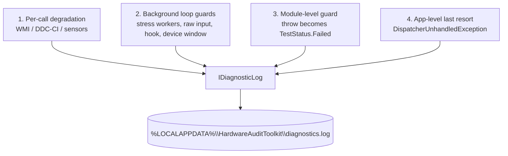

# Fault Containment

Architecture §9.7. **A fault degrades the reading, never the audit.** The rule is
that no single hardware call, no background thread and no UI exception may end the
session — and no fault is silent.

## Four layers of containment



Layer 4 is the last resort, **not the strategy**. A fault reaching it means a
guard is missing somewhere below.

## Layer 1 — per-call degradation

Infrastructure returns an honest reason rather than throwing or fabricating:

```csharp
// DdcCiControl
return new BrightnessReading { Supported = false,
    Detail = "DDC/CI not available (no physical monitor handle; may be disabled in OSD)." };
```

**Rule: never substitute `0` for "unknown".** A missing sensor renders as
`"N/A (sensor unavailable)"`, never `0.0 %`. A fabricated zero in an audit report
is worse than an absent one, because a reader cannot tell it is fabricated.

Gap worth knowing: the honesty is currently *mute*. When
`LibreHardwareMonitorSensorProvider` fails to open — the normal no-admin case — it
swallows the reason and the UI shows a bare `N/A` with no explanation that
elevation is required. Roadmap D2.

## Layer 2 — guard every background loop at its source

A throw on a non-UI thread kills the process outright. Every run loop wraps its
body:

| Loop | Guarded in |
|---|---|
| CPU stress workers (one per core) | `CpuStressModule.Burn` |
| Raw keyboard capture thread | `RawKeyboardInput` |
| Raw mouse capture thread | `RawMouseInput` |
| `Ctrl+E` hook thread | `ExitHotkeyService` |
| Device-change message-only window | `DeviceChangeService` |

```csharp
catch (Exception ex)
{
    Findings.Add($"Burn-in worker failed ({ex.GetType().Name}): {ex.Message}");
    cb = StopInternal(TestStatus.Failed, "...");
}
```

`CpuStressFaultInjectionTests` injects a throwing worker body through an internal
constructor seam and asserts the module records `Failed`, adds a finding, and the
process survives. This is the right shape of test for the principle — replicate it
when adding a new background loop.

## Layer 3 — module-level

`TestOrchestrator.TryStartModule` catches a throw from `Start`, unwinds the
registration so the module is not left wedged in the running set, and records
`Failed`. See [`orchestrator.md`](orchestrator.md).

## Layer 4 — app-level last resort

```csharp
Application.Current.DispatcherUnhandledException += (_, e) =>
{
    log.Write($"unhandled UI exception (app kept alive) — {e.Exception}");
    e.Handled = true;
};
AppDomain.CurrentDomain.UnhandledException += (_, e) => log.Write(...);
TaskScheduler.UnobservedTaskException += (_, e) => { log.Write(...); e.SetObserved(); };
```

Wired first in `OnStartup`, before anything else can fail.

**Hazard:** `e.Handled = true` keeps the app alive but shows the operator nothing.
A throwing UI callback therefore fails *invisibly*. The known instance is the
export folder picker, called outside any `try` in `SessionExporter` — if it throws,
the operator sees no dialog, no error, nothing. Roadmap C6.

## Diagnostics must never throw

`IDiagnosticLog`/`FileDiagnosticLog` swallows its own failures and rotates the file
by rewriting a truncated copy. It is injected into `App`, `RawKeyboardInput`,
`RawMouseInput`, `ExitHotkeyService` and `DeviceChangeService`.

Without it the §9.7 claim "a fault is never silent" would only hold under a
debugger — the whole point is that a *published, portable* build on someone else's
machine remains diagnosable.

## What "Failed" conflates

Because layers 2–4 all record `Failed`, that status currently means both:

- the hardware is broken (operator flagged a defect), and
- our application threw (a worker or `Start` faulted).

A reader cannot distinguish them. Roadmap C5 routes internal diagnostics out of
`Findings`; see [`../reporting/status-vocabulary.md`](../reporting/status-vocabulary.md).

## Checklist for new code

1. Does it run on a non-UI thread? Wrap the loop body.
2. Does it call into Win32/WMI/a sensor? Return a reason, never throw, never fake
   a value.
3. Does it hold an OS resource? Release it in both `Cancel()` and `Dispose()`.
4. Does the failure need to reach the operator, or only the log? If the operator,
   render it — do not rely on layer 4 to keep the app alive silently.
