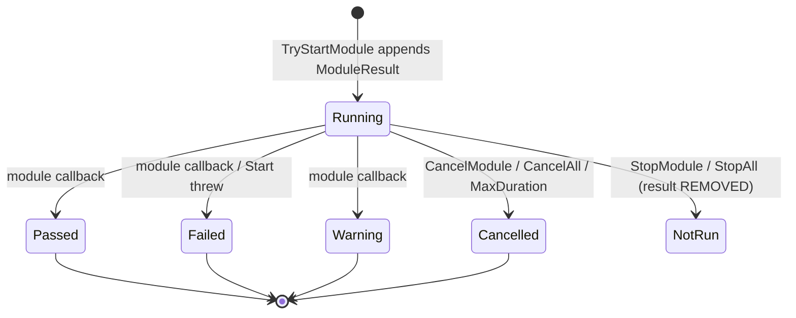

# Test Orchestrator

`Core/TestOrchestrator.cs` — the single coordinator for a session. Owns module
start/cancel, exclusivity, timeouts, and the recording of every result into
`AuditSession`.

## Contract

```csharp
bool TryStartModule(string moduleId, out string reason);  // false + reason, never throws
bool CancelModule(string moduleId);                       // ABORT: records Cancelled; false when not running
bool StopModule(string moduleId);                         // NON-EVENT: records nothing; false when not running
void CancelAll();                                          // abort everything, records Cancelled
void StopAll();                                            // stop everything, records nothing (shutdown)
IReadOnlyList<ITestModule> Modules { get; }
ITestModule? CurrentExclusiveModule { get; }
```

All public members take a single `_gate` lock. `TimeProvider` is injected so
timeout behaviour is deterministic in tests.

## Start gate

`TryStartModule` refuses in four ordered cases, each with a caller-facing reason:

```csharp
if (!_modulesById.TryGetValue(moduleId, out var module))        // unknown id
if (_running.ContainsKey(module.ModuleId))                       // already running
if (!module.CheckPreconditions())                                // preconditions
if (module.Metadata.IsExclusive && _exclusiveModule is not null) // exclusivity
```

**Note:** `CheckPreconditions()` returns `true` in all five modules today, so the
third gate never fires. The declared `RequiredCapabilities` (e.g. `"DDC/CI"`) are
likewise never enforced — the monitor module deliberately still runs and passes
when DDC/CI is unavailable.

## Result lifecycle



**Invariant: one `ModuleResult` per *start*, not per module.** Restarting a module
appends a second record rather than replacing the first —
`RestartAfterCompletion_CreatesSecondResultRecord` guards this. Consequence worth
knowing: visiting the System Info screen three times produces three identical
sections in the report with no run number to tell them apart.

**The non-event paths (roadmap Phase 2, decision D1 — landed).**
`StopModule`/`StopAll` call the module's `Cancel()` (so OS resources are always
released), then **remove the result record from the session** — including the
`Cancelled` record a synchronously-completing `Cancel()` already wrote. Leaving a
test or closing the app therefore writes nothing; the module reads as `Not run`.
Use `CancelModule`/`CancelAll` **only** for the deliberate abort
(`ExitRequestedMessage`). The unattended `MaxDuration` timeout deliberately keeps
`Cancelled` — a timeout is an abort (documented in
[`../reporting/status-vocabulary.md`](../reporting/status-vocabulary.md)).

A result is created with `Status = Running` and `CompletedAt = null`, then updated
**in place** on completion:

```csharp
result.Status = status;
result.CompletedAt = _timeProvider.GetUtcNow().UtcDateTime;
result.Findings.AddRange(module.Findings);
result.Measurements.AddRange(module.Measurements);
result.OperatorActions.AddRange(module.OperatorActions);
result.Artifacts.AddRange(module.Artifacts);
```

**Consequence:** findings and measurements are copied only at completion, so an
export taken mid-run shows a `Running` row with an empty detail section — the keys
already pressed are not in the document.

## The double-record hazard

Cancel arrives by three routes, and modules differ in whether `Cancel()` invokes
the completion callback synchronously. Keyboard, mouse and monitor complete
inline; CPU stress does not. Every cancel site therefore re-checks the running set
before recording:

```csharp
entry.Module.Cancel();
// If the module reported completion through its callback, it has already been
// removed and recorded; otherwise record the cancel here.
if (_running.TryGetValue(id, out var still) && ReferenceEquals(still.Module, entry.Module))
{
    CompleteCancelledEntry(entry, "Cancelled by operator.");
}
```

Removing that guard double-appends the cancel reason and copies every measurement
twice. `OnModuleCompleted` has the mirror guard for stale callbacks that raced a
timeout. Both paths are covered by `TestOrchestratorTests`.

## Start that throws

A module throwing from `Start` must not be left wedged in the running set. The
catch unwinds the registration, clears exclusivity, and records `Failed` with the
finding `"Module.Start threw an exception; the module failed before it could
begin."` — note this internal string reaches the report; roadmap C5.

## Unattended timeout

Any module declaring `Metadata.MaxDuration` gets an `ITimer` at start. On expiry
the module is cancelled and recorded `Cancelled` with the reason
`$"Module exceeded its maximum duration of {MaxDuration} and was force-cancelled."`
The interpolation renders a raw `TimeSpan` (`00:30:00`) into the report.

## Session aggregation

```csharp
if      (Any(Failed))    OverallStatus = Failed;
else if (Any(Warning))   OverallStatus = Warning;
else if (Any(Cancelled)) OverallStatus = Cancelled;
else                     OverallStatus = Passed;   // only Passed remains
```

Only modules with `CompletedAt` set participate. Two consequences that matter:

- **`OverallStatus` describes what ran, not what should have run.** A session where
  only System Info auto-ran exports as `Passed` with no mention of the four
  untested devices. This is the most damaging defect in the product; roadmap C2.
- One early-stopped burn-in turns an otherwise clean five-module audit into
  `Cancelled`, with no counts anywhere to qualify it.

See [`../reporting/status-vocabulary.md`](../reporting/status-vocabulary.md).

## Disposal

`Dispose()` cancels every running module best-effort, disposes timers and clears
state. It runs during `_services.Dispose()` in `App.OnExit`.

## Checkpoints (removed)

The `SessionCheckpointStore` / `ISessionCheckpointStore` crash-persistence layer
was **removed** in roadmap Phase 1 (owner decision D3: no crash recovery). The
orchestrator writes no checkpoint files; the only durable artifacts are the
exported report pair. See [`../plans/open-decisions.md`](../plans/open-decisions.md).
