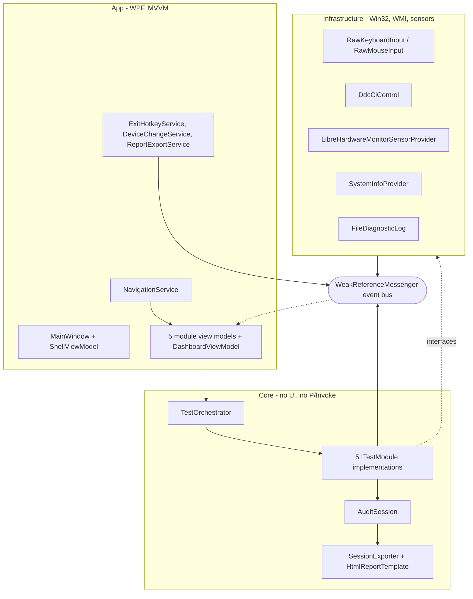

# Architecture Summary

Four layers, one direction of dependency, one composition root.



## Project references

| Project | References | Contains |
|---|---|---|
| `App` | Core, Infrastructure | WPF host, DI root, views, view models, Windows interactions |
| `Core` | Infrastructure | Contracts, orchestrator, session model, the five modules, reporting |
| `Infrastructure` | — | Win32/WMI/sensor wrappers, diagnostics log |
| `Tests` | all three | xunit, fakes for all Infrastructure interfaces |

All target `net8.0-windows` / `win-x64`. Packages: `CommunityToolkit.Mvvm` 8.4.2,
`Microsoft.Extensions.DependencyInjection` 8.0.1, `System.Management` 10.0.2,
`LibreHardwareMonitorLib` 0.9.6.

**Invariant:** Core has no UI reference and no directly-authored P/Invoke. This is
what lets every module state machine be tested with a fake and no hardware. It also
means Core cannot show a dialog — anything requiring Windows interaction is passed
in as a delegate (see [`../reporting/export-cascade.md`](../reporting/export-cascade.md)).

## Startup sequence

`App.OnStartup` order is deliberate; nothing hardware-related runs before the
instance check.

```csharp
WireGlobalFaultHandlers(_diag);                              // 1. last-resort guards
BundleExtractionBootstrap.EnsureExtractionDirectoryRedirected(); // 2. §9.1, next-launch effect
_singleInstance = new SingleInstanceEnforcer();              // 3. §9.3 — before any hook
if (!_singleInstance.TryAcquire()) { SignalFirstInstance(); Shutdown(); return; }
_services = services.BuildServiceProvider();                // 4. DI
shell.ShowDashboard(); mainWindow.Show();                    // 5. UI
_exitHotkey.Start();                                         // 6. §9.2 Ctrl+E thread
_deviceChange.Start();                                       // 7. §9.5 hot-plug
sensors.Start();                                             // 8. ambient telemetry
```

**Why the order matters:** a second launch must not install a global keyboard hook
or spawn stress threads before discovering it is a duplicate. Steps 6–8 are the
"ambient services" — they live outside the orchestrator's exclusive queue and run
for the whole process lifetime.

## Composition root

`App.ConfigureServices` is the single place modules are registered. Each module is
registered twice, deliberately:

```csharp
services.AddSingleton<KeyboardTestModule>();                                   // concrete
services.AddSingleton<ITestModule>(sp => sp.GetRequiredService<KeyboardTestModule>()); // discovered
```

The concrete singleton guarantees the view model drives **the same instance** the
orchestrator discovers through `IEnumerable<ITestModule>`. Registering the
interface with `AddSingleton<ITestModule, KeyboardTestModule>()` would create a
second instance and the UI would drive a module the orchestrator has never heard of.

`AuditSession` is constructed eagerly at configuration time, so a session exists —
with a `SessionId`, hostname and start time — from the moment the app launches,
before any test runs.

**Known cycle:** `ShellViewModel ↔ INavigationService` is wired manually after the
provider is built (`shell.Navigation = navigation`), which is why `ShellViewModel`
has settable `null!` properties rather than constructor injection.

## The event bus

`WeakReferenceMessenger.Default` carries all module→UI and infrastructure→UI
traffic. Messages live in `Core/Messages/`:

| Message | Producer | Consumer |
|---|---|---|
| `KeyEventMessage` | `KeyboardTestModule` | keyboard VM |
| `MouseEventMessage` | `MouseTestModule` | mouse VM |
| `MonitorTestStatusMessage` | `MonitorTestModule` | monitor VM |
| `StressTelemetryMessage` | `CpuStressModule` | CPU VM |
| `SensorReadingsMessage` | sensor provider (ambient) | CPU VM |
| `DeviceTopologyChangedMessage` | `DeviceChangeService` | mouse VM, monitor VM |
| `ExitRequestedMessage` | exit overlay, `Ctrl+E` hook | `App` |

**Registrations are weak**, so the subscriber must be kept alive by DI. This is the
second reason module view models are resolved from the container rather than
constructed ad hoc, and the reason they must be transient — see
[`../practices.md`](../practices.md).

## Where the four hard problems are solved

| Problem | Solution | Detail |
|---|---|---|
| `Ctrl+E` must work under full CPU load | Low-level hook on its own dedicated thread with a minimal message loop, not the WPF dispatcher | [`exit-and-navigation.md`](exit-and-navigation.md) |
| A hardware fault must not end the audit | Guards at every background loop source, plus provider-level degradation | [`fault-containment.md`](fault-containment.md) |
| Two exclusive tests must never overlap | Orchestrator gate keyed on `IsExclusive` | [`orchestrator.md`](orchestrator.md) |
| Mixed-DPI coordinate maths | Per-Monitor V2 declared in the app manifest from the first commit | [`../infrastructure/packaging.md`](../infrastructure/packaging.md) |

## Known structural debt

- **Four sources of truth for the module list**: `IModuleMetadata`, the hardcoded
  list in `DashboardViewModel`, a second hardcoded dictionary in
  `ModulePlaceholderViewModel`, and a string `switch` in `NavigationService`.
  Adding a module means editing four places. Roadmap E1.
- **No persistent header.** `MainWindow.xaml` is a bare `ContentControl`; each of
  the six views copy-pastes its own exit overlay and "Back to dashboard" button.
  Roadmap E2.
