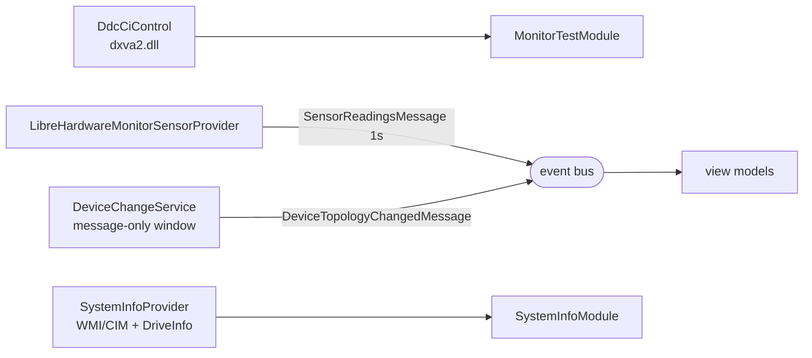

# Hardware Access

DDC/CI monitor control, sensors, WMI inventory, and the device-change listener. All
best-effort, all non-throwing, all honest about failure.



## DDC/CI — `DdcCiControl`

Wraps `dxva2.dll` to read and set monitor brightness (VCP code `0x10`). Loaded
dynamically, so a machine without the API degrades rather than failing to start.

Failure is reported as a specific, reader-intelligible reason:

| Situation | `Detail` |
|---|---|
| API absent | "DDC/CI API not available on this system." |
| Bad index | "Monitor index out of range." |
| No handle | "DDC/CI not available (no physical monitor handle; may be disabled in OSD)." |
| VCP unsupported | "Monitor does not report brightness (VCP 0x10 unsupported)." |
| Read failed | "DDC/CI read failed: …" |

**Contract:** never throw, never return a fabricated brightness. The monitor module
still passes on visual confirmation alone when DDC/CI is unavailable —
`Module_DdcUnsupported_StillRunsAndConfirms` guards this. That is the correct
priority: brightness control is supplementary, pattern inspection is the actual test.

Known gap: `ApplyBrightness` changes the live value but records **no** finding or
measurement, so the brightness the operator set never reaches the report. Only a
support yes/no plus range does. Roadmap C5.

## Sensors — `LibreHardwareMonitorSensorProvider`

Polls LibreHardwareMonitorLib once a second and broadcasts
`SensorReadingsMessage` on the event bus. Ambient: started in `App.OnStartup` and
running for the whole process lifetime, outside the orchestrator's exclusive queue.

```csharp
// Open failure is swallowed; ReadAll() then returns empty
if (!_opened) { return; }
```

**This is the usual case without admin.** Temperatures are typically unavailable, and
the honest consequence propagates correctly: the message carries `null`, and the CPU
stress screen shows `"N/A (sensor unavailable)"` rather than `0.0 %`.

**Known gap:** the honesty is *mute*. The provider swallows the reason, so nothing
tells the operator that elevation is why temperature is missing. That is
[`../../todo.md`](../../todo.md) item 3 and roadmap D2 — surface the open failure so
the UI can say "run as administrator for core temperatures".

Consumers must treat every reading as optional. Note the "is this a CPU reading?"
predicate is currently duplicated in both `CpuStressModule` and its view model and
can drift.

## Inventory — `SystemInfoProvider`

WMI/CIM queries plus `System.IO.DriveInfo` for CPU, RAM, disks, BIOS and OS, all
without elevation. Each query is independently best-effort, so one failing class does
not lose the rest of the snapshot. Results land in `SystemInfoSnapshot`; null fields
are skipped rather than written as empty.

No direct tests, and the indirect assertion is permissive enough to pass if every
query threw — which is how the UI/report field divergence went unnoticed. See
[`../modules/system-info.md`](../modules/system-info.md).

## Device change — `DeviceChangeService`

A hidden message-only window (`HwndSource.AddHook`) listening for two messages:

| Message | Meaning | Consumer |
|---|---|---|
| `WM_INPUT_DEVICE_CHANGE` | keyboard/mouse arrival or removal (paired with `RIDEV_DEVNOTIFY` at raw-input registration) | mouse module |
| `WM_DISPLAYCHANGE` | monitor reconfiguration | monitor module's display picker |

Both surface as `DeviceTopologyChangedMessage`. Started in `App.OnStartup`, ambient
for the process lifetime, and guarded so a throw in the pump degrades rather than
killing the process.

**What this buys:** unplugging a mouse mid-drag records an honest incomplete-drag
finding instead of freezing the module, and plugging in a monitor updates the picker
instead of showing stale state.

**Asymmetry worth knowing:** only the mouse and monitor modules consume this. The
keyboard module never subscribes, so an unplugged keyboard mid-test is unrecorded.

## Rules for adding a hardware call

1. Define the interface first; Core depends on it, never on the class.
2. Return a result carrying a reason. Never throw across the boundary.
3. Never fabricate a value — no `0` for "unknown".
4. If it holds an OS resource, release it in both `Cancel()` and `Dispose()`.
5. If it can fail for a *fixable* reason (permissions, disabled in OSD), make the
   reason reachable by the UI. An honest `N/A` the operator cannot act on is only
   half the job — this is the lesson of the temperature gap.
