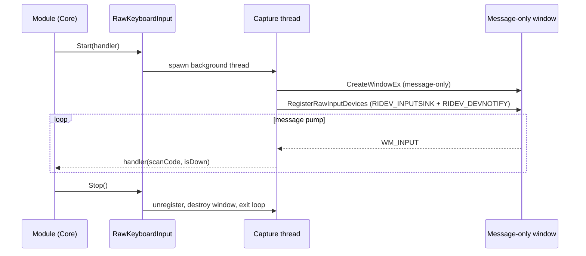

# Raw Input

`Infrastructure/RawKeyboardInput.cs` and `RawMouseInput.cs`, behind
`IRawKeyboardInput` / `IRawMouseInput`. The largest and riskiest files in
Infrastructure — they resemble keylogger behaviour to AV/EDR heuristics, which is why
code-signing is a pre-ship requirement.

## Why raw input rather than a hook

`RegisterRawInputDevices` gives the **physical** device signal:

- **scan codes**, not virtual keys — the keyboard test must verify the switch under
  the cap, independent of the active layout;
- device arrival/removal notifications via `RIDEV_DEVNOTIFY`, which is how hot-plug
  is detected (§9.5);
- no elevation required.

A `WH_KEYBOARD_LL` hook is used for exactly one thing — the global `Ctrl+E` exit —
because that must fire regardless of focus. The two mechanisms are independent, which
is why `Ctrl+E` still works during raw capture.

## Shape

Each wrapper owns a **message-only window on its own dedicated thread** with a
minimal pump. The window exists solely to receive `WM_INPUT`; it is never shown.

`RIDEV_INPUTSINK` is what lets capture continue when the app is not foreground —
necessary because the operator may click away mid-test.

## Teardown is the critical invariant

**Registration is released in both places:**

1. the owning module's `Cancel()`;
2. the module view model's `Dispose()`.

Neither implies the other. The operator can navigate away without cancelling, and the
orchestrator can cancel without the screen changing. Releasing in only one place
leaks input capture across navigation — the whole system keeps receiving keystrokes
after the test screen is gone.

Teardown destroys the window, exits the pump, and joins the thread. Both
`KeyboardModuleTests` and `MouseModuleTests` assert capture is stopped after
`Cancel()` via their fakes.

## Keyboard specifics

- Scan-code based. `Core/Keyboard/KeyboardLayout.cs` maps scan code → key id → tile,
  for a hardcoded **ANSI US 104-key** layout. Non-US layouts are a v2 item, so a UK or
  DE keyboard will always report missing keys.
- Keys outside the layout are ignored rather than erroring.
- `Esc` is delivered as ordinary data — no special casing anywhere in this layer.

## Mouse specifics

- Scan-agnostic stream of button down/up, wheel ticks and movement deltas. The
  classification of a press/release pair into click vs drag vs drop lives in
  `MouseTestModule`, not here — this layer stays a transport.
- Subscribes to device notifications so an unplug mid-hold becomes a
  `DeviceTopologyChangedMessage` rather than a freeze.

## Fault guarding

The capture thread body is wrapped so a throw degrades to "unavailable" and is
written to `IDiagnosticLog`, rather than killing the process. A throw on this thread
would otherwise be fatal — it is not the UI thread, so
`DispatcherUnhandledException` cannot catch it. See
[`../architecture/fault-containment.md`](../architecture/fault-containment.md).

## Interop

`SYSLIB1054` is suppressed in both files with justification: `Wndclassex` carries
`string` members and cannot be marshalled by the `LibraryImport` generator. Do not
convert these signatures without first making the native types blittable. See
[`summary.md`](summary.md).

## Security posture

Global keyboard capture plus a low-level hook is exactly the heuristic profile of a
keylogger. Mitigations are deployment-level, not code-level:

- Authenticode signing via the org PKI (pre-ship, manual).
- An EDR pass before wide rollout (pre-ship, manual).
- `docs/DeploymentNote.md` — a one-page handout with SHA-256, publisher, extraction
  path and a plain description a technician can give a security team **before** the
  tool gets blocked in the field.

See [`packaging.md`](packaging.md).

## Testing

No direct tests — these are thin wrappers over OS calls that cannot be exercised
without hardware. Core modules are tested against `FakeRawKeyboardInput` and
`FakeRawMouseInput` instead. The consequence is that a marshalling or teardown bug
surfaces only on real hardware, which is why "every physical key registers" remains a
manual definition of done.
