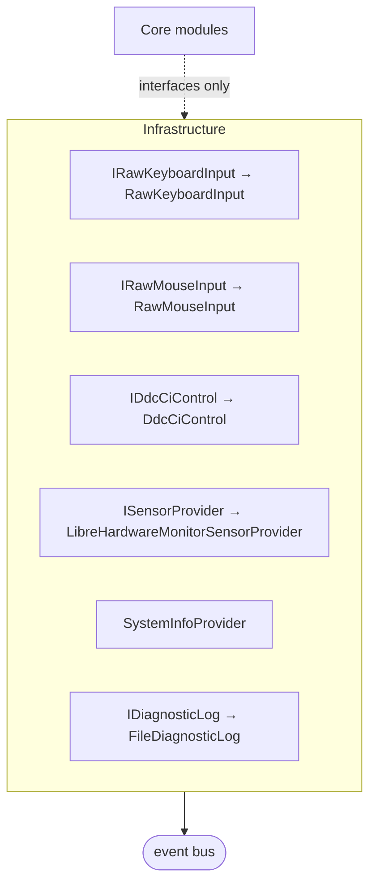

# Infrastructure Summary

`Src/Infrastructure/` — every Win32, WMI and sensor call in the product. Nothing
else in the solution touches the OS directly.



| File | Topic |
|---|---|
| [`raw-input.md`](raw-input.md) | Keyboard and mouse raw capture |
| [`hardware-access.md`](hardware-access.md) | DDC/CI, sensors, WMI inventory, device-change listener |
| [`packaging.md`](packaging.md) | Single-file publish, DPI manifest, single-instance |

## Two contracts every Infrastructure type honours

**1. Interface first.** Core depends only on the interface, never the class. This is
what makes every module state machine testable with a fake and no hardware
(`FakeRawKeyboardInput`, `FakeRawMouseInput`, `FakeDdc`). Adding a concrete
dependency into Core would make the module untestable off real hardware.

**2. Best-effort, honest, non-throwing.** A call may fail; it must not throw, and it
must report a reason rather than fabricate a value:

```csharp
return new BrightnessReading { Supported = false,
    Detail = "Monitor does not report brightness (VCP 0x10 unsupported)." };
```

**Never substitute `0` for "unknown".** A fabricated zero in an audit report is worse
than an absent value, because a reader cannot tell it is fabricated. See
[`../architecture/fault-containment.md`](../architecture/fault-containment.md).

## No elevation, anywhere

Every API used here works without admin:

| Capability | API | Without admin |
|---|---|---|
| Raw keyboard/mouse | `RegisterRawInputDevices` | full |
| Global hotkey | `SetWindowsHookEx(WH_KEYBOARD_LL)` | full |
| Inventory | WMI/CIM + `DriveInfo` | full |
| Monitor brightness | `dxva2.dll` | inconsistent regardless of privilege |
| Sensors | LibreHardwareMonitorLib | **partial** — temperatures usually unavailable |

Only the last two degrade, and both are designed to degrade honestly. Admin-gated
enhancements are deferred to v2.

## Message-only windows

Three components create a hidden `HWND` whose only purpose is to receive Win32
messages: `RawKeyboardInput`, `RawMouseInput` and `DeviceChangeService`. Each pumps
its own message loop on its own thread, guarded so a throw degrades rather than
killing the process.

**Invariant:** every one of these is torn down in both the owning module's `Cancel()`
and the view model's `Dispose()`. Releasing in only one place leaks input capture
across navigation.

## Interop policy

`SYSLIB1054` (prefer `LibraryImport`) is **suppressed per file with justification**
in `DeviceChangeService`, `DdcCiControl`, `RawKeyboardInput` and `RawMouseInput`. The
source generator cannot marshal:

- non-blittable structs carrying `string`/`ByValTStr` members — `Wndclassex`,
  `MONITORINFOEX`, `PHYSICAL_MONITOR`;
- a delegate callback — `EnumDisplayMonitors`.

Blittable signatures **do** use `LibraryImport` — e.g. `SetWindowPos` in
`MonitorPatternWindow`, which is why the App project sets
`<AllowUnsafeBlocks>true</AllowUnsafeBlocks>`.

**Do not "modernise" the suppressed files** without first making the native types
blittable. The suppression is a decision, not an oversight.

## Diagnostics

`FileDiagnosticLog` writes to
`%LOCALAPPDATA%\HardwareAuditToolkit\diagnostics.log`, rotates by truncation, and
**swallows its own failures**. It is injected into `App`, `RawKeyboardInput`,
`RawMouseInput`, `ExitHotkeyService` and `DeviceChangeService`.

Without it, the §9.7 claim "a fault is never silent" would hold only under a
debugger — the point is that a portable build on someone else's machine stays
diagnosable.

## Testing posture

Infrastructure has **no direct tests**. `RawKeyboardInput`, `RawMouseInput`,
`DdcCiControl`, `DeviceChangeService`, `ExitHotkeyService`, `SingleInstanceEnforcer`,
`BundleExtractionBootstrap` and `FileDiagnosticLog` are all uncovered, and
`SystemInfoProvider` only indirectly (permissively — the assertion passes even if
every WMI query threw).

This is a deliberate trade: these types are thin wrappers over OS calls that cannot
be meaningfully tested without hardware, so the interfaces are faked and the
**modules** are tested instead. The cost is that a marshalling or teardown bug is
only caught on real hardware — which is why two definitions of done ("every physical
key registers", "patterns render at correct scale") remain manual.
