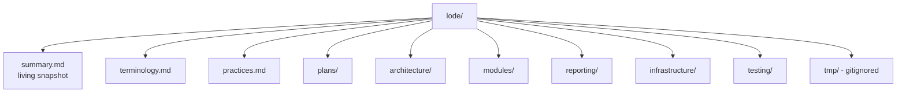

# Lode Map

Index of all project memory. **Read this first**, then the specific domain, before
searching code.

Start every session with [`summary.md`](summary.md),
[`terminology.md`](terminology.md) and this file.

## Top level

| File | Contents |
|---|---|
| [`summary.md`](summary.md) | One-paragraph snapshot, the two principles that hold, the two unanswered questions, where to start reading |
| [`terminology.md`](terminology.md) | Domain language: roles, session, module, exit, reporting, infrastructure terms |
| [`practices.md`](practices.md) | Layering rules, transient view models, double teardown, best-effort contract, house style, test conventions, interop policy |
| `lode-map.md` | This index |

## plans/

| File | Contents |
|---|---|
| [`plans/roadmap.md`](plans/roadmap.md) | Passes A–E: subtract, decide, fix the output, operator environment, coherence. Plus v2 deferrals and the manual pre-ship checklist |
| [`plans/open-decisions.md`](plans/open-decisions.md) | **D1** what does leaving a test mean · **D2** operator judgment or coverage · **D3** does crash recovery exist. Each blocks specific roadmap work |

## architecture/

| File | Contents |
|---|---|
| [`architecture/summary.md`](architecture/summary.md) | Layer diagram, project references, startup order, composition root, event-bus catalogue, structural debt |
| [`architecture/orchestrator.md`](architecture/orchestrator.md) | Start gate, result lifecycle, the double-record hazard, timeouts, session aggregation |
| [`architecture/exit-and-navigation.md`](architecture/exit-and-navigation.md) | The four exit paths, why `Ctrl+E` has its own thread, Esc asymmetry, navigation disposal, auto-start inconsistency |
| [`architecture/fault-containment.md`](architecture/fault-containment.md) | Four layers of guarding, the never-fabricate rule, diagnostics, what `Failed` conflates |

## modules/

| File | Contents |
|---|---|
| [`modules/summary.md`](modules/summary.md) | The `ITestModule` contract, all five modules at a glance, the two trust models, how to add a module |
| [`modules/keyboard.md`](modules/keyboard.md) | ANSI layout, per-key state machine, the disputed `Warning`, Esc-is-data, WPM sub-screen |
| [`modules/mouse.md`](modules/mouse.md) | Click/drag/drop classification, hot-plug handling, no coverage floor, tracing sub-screen |
| [`modules/monitor.md`](modules/monitor.md) | Pattern window, the Exit-cancels bug, DDC/CI, multi-monitor picker |
| [`modules/cpu-stress.md`](modules/cpu-stress.md) | Safety model, `BelowNormal` workers, live graph, temperature muteness, Stop-records-`Cancelled` |
| [`modules/system-info.md`](modules/system-info.md) | Non-exclusive design, the auto-start that enables a green unaudited report, UI/report divergence |

## reporting/

| File | Contents |
|---|---|
| [`reporting/summary.md`](reporting/summary.md) | The pipeline, invariants that hold, defects in priority order, rules for changing this layer |
| [`reporting/session-model.md`](reporting/session-model.md) | `AuditSession`/`ModuleResult`/`ModuleMeasurement`, the JSON contract, four dead fields |
| [`reporting/export-cascade.md`](reporting/export-cascade.md) | The five §9.6 steps, write-test probe, Core/App seam, the `CompletedAt` ordering bug, invisible failure |
| [`reporting/html-report.md`](reporting/html-report.md) | Template structure, what leaks to the reader, dead branches, what the document never says |
| [`reporting/status-vocabulary.md`](reporting/status-vocabulary.md) | Which statuses are real, `Cancelled` overloaded five ways, aggregation precedence |

## infrastructure/

| File | Contents |
|---|---|
| [`infrastructure/summary.md`](infrastructure/summary.md) | The two contracts, no-elevation table, message-only windows, interop policy, testing posture |
| [`infrastructure/raw-input.md`](infrastructure/raw-input.md) | Why raw input over a hook, capture thread shape, the teardown invariant, security posture |
| [`infrastructure/hardware-access.md`](infrastructure/hardware-access.md) | DDC/CI, sensors, WMI inventory, device-change listener, rules for adding a hardware call |
| [`infrastructure/packaging.md`](infrastructure/packaging.md) | Publish profiles, extraction redirect, single-instance mutex, Per-Monitor V2, runtime footprint |

## testing/

| File | Contents |
|---|---|
| [`testing/summary.md`](testing/summary.md) | Coverage map, conventions, the untested report, zero-coverage list, plumbing-only tests |

## tmp/

Git-ignored session scraps and handover documents. Nothing here is permanent
knowledge; if it matters beyond the session it belongs in a domain file above.

## External documents

| Document | Role |
|---|---|
| [`../Src/docs/hardware-audit-toolkit-architecture.md`](../Src/docs/hardware-audit-toolkit-architecture.md) | Original design intent. All `§n` references in code point here. **Read as intent, not current state** |
| [`../Src/docs/DeploymentNote.md`](../Src/docs/DeploymentNote.md) | One-pager for security teams: hash, extraction path, signing |
| [`../Src/README.md`](../Src/README.md) | Human-facing current state, build/publish, conventions |
| [`../taste-audit.md`](../taste-audit.md) | Design review with full file:line evidence; source of the roadmap |
| [`../todo.md`](../todo.md) | Raw operator complaints — the highest-signal input in the repo |

## Maintenance rules

1. **Current state, never changelog.** Describe what the system *is*. If you need to
   record what changed, put it in `tmp/`.
2. **One topic per file, under 250 lines.** Decompose rather than grow.
3. **Code beats lode.** If they disagree, the code is right — summarise the disparity
   and ask before "fixing" the lode.
4. **Update immediately after changing behaviour or structure**, before moving to the
   next task.
5. **Mermaid only** for diagrams.
6. When a roadmap pass lands, update the affected domain files *and* prune the defect
   from its "known defects" table — a fixed defect left documented is worse than
   undocumented.
