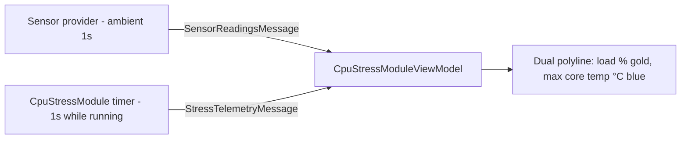

# CPU Stress Module

`Core/Modules/CpuStressModule.cs` + `App/ViewModels/CpuStressModuleViewModel.cs`
+ `App/Views/CpuStressView.xaml`. Exclusive, **does not auto-start**.

**Purpose:** load every core for a fixed duration so the operator can watch for
thermal throttling, instability or a fan that never spins up.

## Safety model (architecture §8)

There is **no automatic thermal cutoff in v1**, deliberately: temperature access is
best-effort without admin and cannot be relied on for a safety decision. Instead:

- a technician-set duration with a conservative **300-second cap** (`Duration`
  clamps to ≤300; metadata `MaxDuration` is 310s so the orchestrator's timeout is a
  backstop, not the primary stop),
- a prominent manual **Stop test** control,
- `Ctrl+E` and the header **Exit Test** button always available.

Admin-mode opt-in with full sensor detail and a real thermal cutoff is deferred to
v2.

## Worker setup

```csharp
// one thread per logical core — not reduced; loading every core is the point
for (int i = 0; i < Environment.ProcessorCount; i++)
{
    var t = new Thread(Burn) { IsBackground = true, Priority = ThreadPriority.BelowNormal };
}
```

`BelowNormal` is the key decision: every core still gets loaded, but the OS keeps
favouring the UI thread and — critically — the `Ctrl+E` hook thread under
contention. See [`../architecture/exit-and-navigation.md`](../architecture/exit-and-navigation.md).

`Burn` is a tight `Math.Sqrt`/`Math.Sin` loop with a `Thread.Yield()` every 1024
iterations. The body is injectable through an internal constructor seam so
`CpuStressFaultInjectionTests` can prove a throwing worker degrades to `Failed`
rather than killing the process.

## Telemetry and the live graph



The graph is **already plotting before the test starts** — it consumes ambient
`SensorReadingsMessage` broadcasts from the moment the screen opens, then continues
through the burn-in from `StressTelemetryMessage`. So the operator sees idle
baseline, then the ramp. That is a genuinely good decision: the contrast is what
makes the burn-in readable.

Load is drawn on a fixed 0–100 axis; temperature auto-scales to its own min/max.
Missing (`NaN`) samples are skipped rather than drawn as zero.

## Temperature is wired end-to-end and now explains unavailability

```csharp
if (reading.SensorType == "Temperature") { temps.Add(reading.Value); }
```

Temperature reaches `TempsText` and `TempPoints` **when the sensor provider returns
readings**. When `LibreHardwareMonitorSensorProvider` cannot open — the normal
no-admin case — the provider captures the failure reason and the UI shows
`"N/A — Sensor access unavailable — run as administrator for core temperatures."`
instead of the previous mute `"N/A (sensor unavailable)"`. The reason is propagated
through `StressTelemetryMessage.SensorUnavailableReason` and
`SensorReadingsMessage.UnavailableReason`.

## Display-sleep prevention

`SetThreadExecutionState(ES_CONTINUOUS | ES_DISPLAY_REQUIRED | ES_SYSTEM_REQUIRED)`
is called when the burn-in starts and cleared with `ES_CONTINUOUS` when it stops
(normal completion, early stop, or cancel). During a 5-minute run the monitor stays
on so the operator does not assume the machine crashed ([`../../todo.md`](../../todo.md)
item 3, roadmap D1).

## Pass criteria

| Outcome | Trigger |
|---|---|
| `Passed` | the full target duration elapses (`Task.Delay` → `CompleteNaturally`), **or** the operator presses **Stop** (`CompleteEarly`) — the finding states the achieved duration |
| `Failed` | a burn-in worker throws |
| `Cancelled` | `Ctrl+E` / header Exit Test, or the 310s backstop timeout |
| (nothing) | navigating away or closing the app — `StopAll` records nothing (roadmap Phase 2) |

**Resolved (D1).** Stop is the intended end of a shortened burn-in, so it records
`Passed` with `"Burn-in stopped by the operator after 0:30 of the 5:00 target."`
instead of `Cancelled`. A deliberate 30-second smoke test no longer reads like an
abandoned run, and one early stop no longer drags the session to `Cancelled`.

## Screen surface

- Cores loaded count; large elapsed/target readout; progress bar.
- CPU LOAD and TEMPERATURES readouts.
- Note: *"All cores run at BelowNormal priority…"* — engineering detail on the
  operator's screen.
- Live dual-line graph with axis note.
- Buttons: Start test, Stop test, Back to dashboard.

## The one well-documented default in the product

```csharp
// CpuStressView.xaml.cs
// Deliberate: NO auto-start (Phase 2 improvement) — the operator starts the
// burn-in explicitly, so the machine isn't loaded the moment the screen opens.
```

This is the standard the other four modules should be held to (roadmap B3). Every
other screen auto-starts without recording why.

## Known defects

| Defect | Detail | Fix |
|---|---|
| ~~No display-sleep prevention~~ | ~~Zero `SetThreadExecutionState` calls in the solution. During a 5-minute run the monitor blanks and the operator assumes the machine crashed.~~ | Fixed — `SetThreadExecutionState` called on start, cleared on stop/cancel/dispose |
| ~~No permissions notice for temperature~~ | ~~Honest `N/A` but no explanation that admin is required.~~ | Fixed — `UnavailableReason` propagated from provider to view model; shows "run as administrator" notice |
| ~~Graph gutters instead of filling~~ | ~~A fixed 640×220 `Canvas` inside `Viewbox Stretch="Uniform"` — it scales but centres with side gutters on wide windows.~~ | Fixed — `Viewbox` now `Stretch="Fill"` and `HorizontalAlignment="Stretch"` |
| ~~Stop records `Cancelled`~~ | ~~A successful early stop is indistinguishable from abandonment.~~ | Fixed — `CompleteEarly()` resolves `Passed` with the achieved-duration finding |
| Duplicated "is this a CPU reading?" predicate | The same `SensorName.Contains("CPU") \|\| HardwareName.Contains("CPU")` logic lives in both the module and the view model, and can drift. | — |
| `BelowNormal` in a finding and on screen | Thread-priority detail leaks to the reader and the operator. | C5 |
| Terminology drift | The report heading says "CPU Stress Test"; the findings say "Burn-in". | C5 |

## Tests

`Src/Tests/CpuStressFaultInjectionTests.cs` — injected worker throw → `Failed` +
finding, process survives. Exactly the right test for the fault-containment
principle.

`Src/Tests/Phase2ModuleTests.cs` covers start/cancel.

**Untested:** the natural `Passed` completion path, the `Duration` clamp, and
`PublishTelemetry`.
