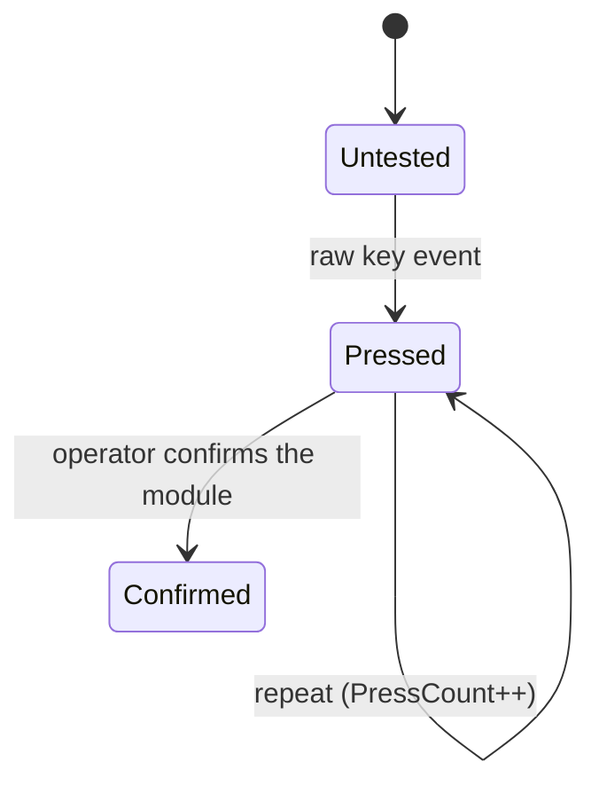

# Keyboard Test Module

`Core/Modules/KeyboardTestModule.cs` + `App/ViewModels/KeyboardTestModuleViewModel.cs`
+ `App/Views/KeyboardTestView.xaml`. Exclusive, 30-minute cap, auto-starts on
`Loaded`.

**Purpose:** confirm every physical key on the machine registers.

## Layout

`Core/Keyboard/KeyboardLayout.cs` defines a hardcoded **ANSI US 104-key** layout as
vector tiles. `ExpectedCount` is 104. Non-US layouts are explicitly deferred to v2,
so a UK or DE keyboard will always report missing keys.

Matching is by **scan code**, not virtual key — the point is to verify the physical
switch, independent of the active keyboard layout.

## Per-key state machine



`KeyViewModel.ShowCountBadge` is `PressCount > 1`, so a key pressed more than once
gets a red repeat badge — this exists because a stuck or chattering key is a real
defect the operator needs to see.

Keys outside the layout are ignored (`KeyboardModuleTests` covers this).

## Pass criteria

```csharp
// Confirm()
PromoteToConfirmed();
if (missing.Count == 0)
{
    Findings.Add("Operator confirmed: every expected key registered at least once.");
    status = TestStatus.Passed;
}
else
{
    Findings.Add($"Operator confirmed, but {missing.Count} key(s) were never pressed: {…}.");
    status = TestStatus.Passed;
}
```

| Outcome | Trigger |
|---|---|
| `Passed` | operator confirms (coverage is recorded as a finding, not a verdict) |
| `Failed` | operator presses **Flag defective key** |
| `Cancelled` | `Ctrl+E`, exit overlay, navigate away, or the 30-minute cap |

The module transitions to `AwaitingOperatorConfirmation` once all keys are pressed,
but `Confirm` is enabled throughout `IsRunning` — so the operator can confirm early.
Operator judgment is authoritative: confirming with missing keys records the missing
keys in the finding but resolves as `Passed`. This fixes the `todo.md` item 1
override where the tool previously forced `Warning` against the operator's attestation.

## Esc is data, not an exit

The keyboard module is the one place `Esc` carries no exit meaning — the operator
must be able to verify the `Esc` key works. `Ctrl+E` still exits, because the hook
is independent of the module's raw-input registration. See
[`../architecture/exit-and-navigation.md`](../architecture/exit-and-navigation.md).

Status message on start: *"Press each key once. Esc is captured as data — use
Ctrl+E or Exit Test to leave. Confirm when done."*

## Screen surface

- 104-key grid, tiles coloured by state via `KeyStateToBrushConverter`.
- Per-key repeat badge (press count, shown when > 1).
- Progress text `"N / 104 keys tested"`.
- **Pinned, newest-first key-press log** at the bottom, capped at 500 lines.
  Deliberately pinned rather than a scrollable page section, mirroring the mouse
  test.
- Buttons: Start test, Confirm all keys work, Flag defective key, Reset,
  Back to dashboard, and the WPM toggle.

## Teardown

Raw-input registration is torn down in **both** `Cancel()` and view-model
`Dispose()`, so navigating away never leaks keyboard capture. The view model also
calls `CancelModule` on disposal — which is why walking away records `Cancelled`.

## Known defects

| Defect | Detail | Fix |
|---|---|---|
| WPM sub-screen measures the operator | Gross WPM and character accuracy against a hardcoded pangram (`"The quick brown fox…"`). Does not affect any status. Tests typing skill, not hardware. | A1 |
| **The WPM screen pollutes coverage** | `ToggleWpm` only flips a view flag; raw capture keeps running, so typing the pangram silently fills the very coverage metric that decides Pass vs `Warning`. | A1 |
| WPM data can be silently dropped | `RecordWpm` has no `IsRunning` guard, and the sub-screen is reachable before `Start` (which clears findings) and after completion (result already finalised) — yet the screen promises "recorded to the session". | A1 |
| Defect note wired | The "What's wrong?" field sends the operator's text to `FlagDefect(note)`; blank falls back to the default wording. | Done (C4) |
| No device-loss handling | Unlike the mouse module, this one never subscribes to `DeviceTopologyChangedMessage`; an unplugged keyboard mid-test is unrecorded. | — |
| Coverage numbers only on failure | A clean pass records no numbers at all; `PressedCount`/`ExpectedCount` are never written as measurements, so the report cannot show "104/104". | C2/C5 |
| Dead default strings | `StatusDetail = "Press Start to begin…"` and `ProgressText = "0 / 0 keys tested"` are overwritten by auto-start before ever being seen. | A1/B3 |

## Tests

`Src/Tests/KeyboardModuleTests.cs` — 8 methods over a `FakeRawKeyboardInput`:
layout uniqueness and labels, all-keys→`Passed`, missing-keys→`Passed` with a
finding listing the untested keys, flag→`Failed`, cancel→`Cancelled` with capture
stopped, out-of-layout keys ignored, and the repeat counter. One is a DI-registration
check.

Untested: the WPM/accuracy maths in the view model.
