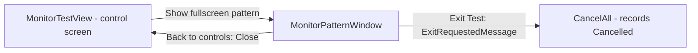

# Monitor Test Module

`Core/Modules/MonitorTestModule.cs` + `App/ViewModels/MonitorTestModuleViewModel.cs`
+ `App/Views/MonitorTestView.xaml` + `App/Views/MonitorPatternWindow.xaml`.
Exclusive, 30-minute cap, **auto-starts on `Loaded`**.

**Purpose:** let the operator inspect fullscreen test patterns on each attached
display and confirm they render correctly.

## Two screens



**The control screen** carries the display picker, the DDC/CI brightness block, the
pattern selector, and the verdict buttons.

**The pattern window** is true edge-to-edge fullscreen with no native chrome —
required for accurate colour testing. It is placed on the chosen display via
`SetWindowPos` **in raw device pixels**, so it lands correctly on mixed-DPI setups.
This is why Per-Monitor V2 had to be declared in the manifest from the first commit
rather than retrofitted.

## Pattern window behaviour

- **Click anywhere on the pattern surface advances to the next pattern** (wrapping),
  and each advanced pattern is recorded through an advance callback.
- The only readout is `"Pattern {i}/{n}: {name} — click to advance"`.
- The overlay panel **auto-hides after 3s** of no mouse movement and reappears on
  `MouseMove`. Both buttons hide together, so after three still seconds the screen
  has no visible affordances at all.
- Nine patterns: solids, gradients, grid and crosshatch, built as `DrawingBrush`es.

## Pass criteria

| Outcome | Trigger |
|---|---|
| `Passed` | operator presses **Confirm patterns OK** |
| `Failed` | operator presses **Flag defect** |
| `Cancelled` | `Ctrl+E` / header Exit Test (the one abort), or the cap. Navigating away records nothing (roadmap Phase 2) |

Perceptual check by design — architecture §5 says the operator's confirmation *is*
the status for monitor uniformity. There is no objective criterion available.

## The Exit-cancels bug — resolved

[`../../todo.md`](../../todo.md) item 2, traced:

```
ExitOverlay button (no longer present anywhere; the header Exit Test remains)
  → ExitRequestedMessage
  → App.HandleExitRequested
  → orchestrator.CancelAll()
  → MonitorTestModule.Cancel()
  → StopInternal(TestStatus.Cancelled, "Monitor test cancelled.")
```

From the fullscreen pattern window the operator now sees only **"Back to
controls"** (`Close()`), which returns to the monitor screen and — after the
roadmap Phase 2 change — records nothing when the monitor screen is left
(`StopModule`). The keyboard-only abort from fullscreen is `Ctrl+E`, which still
records `Cancelled`. The `ExitOverlay` control was deleted entirely (roadmap E2);
the Exit Test button lives in the persistent window header.

## DDC/CI brightness

Best-effort `dxva2.dll` control, and the module is explicit that it is
supplementary: *"A monitor can therefore still Pass on visual confirmation alone."*

```csharp
Findings.Add(_ddcSupported
    ? $"DDC/CI brightness supported on selected display: current {_brightnessCurrent} (range {_brightnessMin}–{_brightnessMax})."
    : "DDC/CI brightness not available on the selected display (best-effort; pattern inspection still applies).");
```

Degradation is clean: the slider is disabled when unsupported, an explanatory note
appears, and `DdcCiControl` returns specific reasons ("VCP 0x10 unsupported",
"may be disabled in OSD", "DDC/CI API not available on this system").

**Two gaps.** `RequiredCapabilities => ["DDC/CI"]` is declared but never enforced —
`CheckPreconditions()` returns `true` — so the declaration is misleading. And
`ApplyBrightness` changes the live value but records **no** finding or measurement,
so the brightness the operator actually set never reaches the report. The audit
captures only a support yes/no plus range.

Worth scrutinising against "every feature earns its place": the slider, picker,
detail text and note are real surface area contributing one boolean to the report.

## Multi-monitor picker

Displays are enumerated with friendly name, resolution and a "primary" marker. The
picker reacts live to `WM_DISPLAYCHANGE` via `DeviceTopologyChangedMessage`, so
plugging or unplugging a screen updates the list instead of showing stale state.

Display findings are recorded per monitor:
`$"Display {m.Index}: {m.FriendlyName} ({m.Width}x{m.Height}, primary)"` — note the
zero-based internal index and the missing terminating period, inconsistent with
every other finding in the product.

## Known defects

| Defect | Detail | Fix |
|---|---|
| ~~Exit from fullscreen records `Cancelled`~~ | ~~The operator's own complaint.~~ | Fixed — `ExitOverlay` hidden in `MonitorPatternWindow`; only "Back to controls" is visible |
| ~~Auto-start on `Loaded`~~ | ~~Opening and leaving the control screen stamps `Cancelled`.~~ | Fixed (roadmap Phase 2.6) — no auto-start; explicit Start only |
| ~~Start button dead after auto-start~~ | ~~`CanStart => !IsRunning && !IsCompleted`, and **Reset** is disabled while running, so there is no clean re-run path.~~ | Moot — no auto-start |
| Brightness changes unrecorded | `ApplyBrightness` adds no finding or measurement. | C5 |
| Declared capability unenforced | `RequiredCapabilities` is decorative. | A6-adjacent |
| Doc/code mismatch | The view-model comment claims the control screen uses "the auto-hiding Exit overlay"; only the pattern window auto-hides. | C5 |
| Duplicated brush builders | `MakeGridBrush`/`MakeCrosshatchBrush` are copy-paste differing only in geometry. | — |
| Finding punctuation inconsistent | Display rows have no terminating period. | C5 |

## Tests

`Src/Tests/MonitorModuleTests.cs` — 6 methods over a `FakeDdc`: confirm/flag/cancel,
`ApplyBrightness` delegation, and the important
`Module_DdcUnsupported_StillRunsAndConfirms` case proving DDC/CI failure never
blocks a pass. One is a DI-registration check.

Untested: pattern-window placement maths and the advance callback (both need real
displays).
