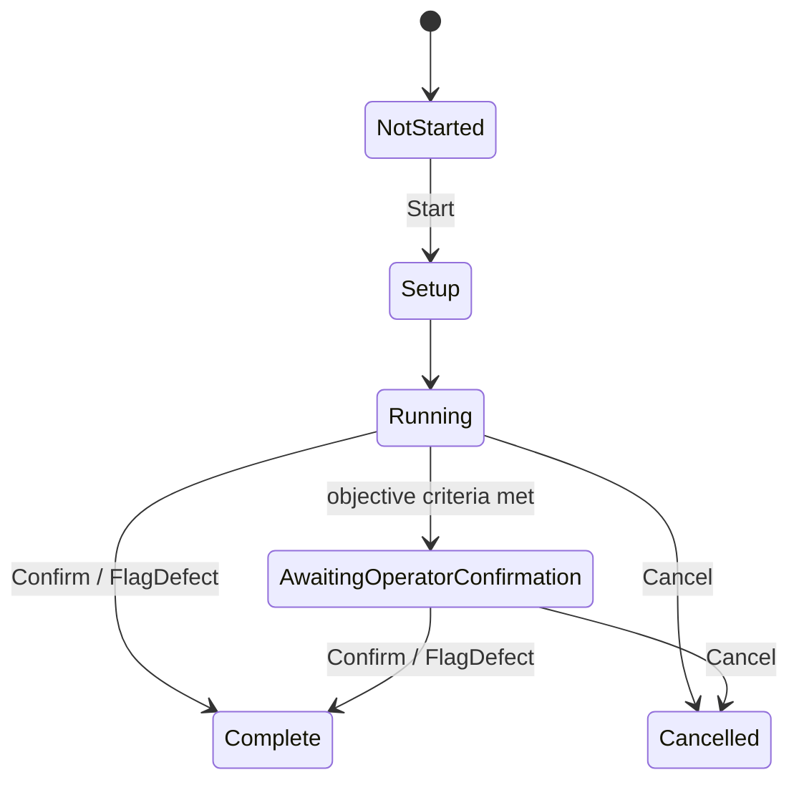

# Modules Summary

Five `ITestModule` implementations in `Core/Modules/`. All are discovered through
DI as `IEnumerable<ITestModule>` and coordinated by
[`../architecture/orchestrator.md`](../architecture/orchestrator.md).

## The contract

```csharp
public interface ITestModule
{
    IModuleMetadata Metadata { get; }
    string ModuleId { get; }
    ModulePhase CurrentPhase { get; }
    bool IsRunning { get; }
    IList<ModuleMeasurement> Measurements { get; }
    IList<string> Findings { get; }
    IList<string> OperatorActions { get; }
    bool CheckPreconditions();
    void Start(Action<TestStatus> onComplete);  // must return promptly
    void Cancel();
}
```

**Invariants**

- `Start` returns promptly; work happens asynchronously.
- `onComplete` fires **exactly once**.
- `Start` clears `Findings`/`Measurements`/`OperatorActions` — a restart
  is a clean slate, and anything recorded before `Start` is lost.
- `Cancel()` releases every OS resource, and so does the view model's `Dispose()`.



`ModulePhase` is the lifecycle position; `TestStatus` is the recorded verdict. They
are separate — see [`../reporting/status-vocabulary.md`](../reporting/status-vocabulary.md).

## The five modules

| Id | Display name | Exclusive | Max duration | Starts | Passes when | Lode |
|---|---|---|---|---|---|---|
| `keyboard` | Keyboard Test | yes | 30 min | **explicit Start** | confirm (coverage recorded as a finding) | [keyboard](keyboard.md) |
| `mouse` | Mouse Test | yes | 30 min | **explicit Start** | confirm (no coverage floor) | [mouse](mouse.md) |
| `monitor` | Monitor Test | yes | 30 min | **explicit Start** | confirm patterns render correctly | [monitor](monitor.md) |
| `system` | System Info | **no** | — | in the VM **constructor** | inventory collected | [system-info](system-info.md) |
| `stress` | CPU Stress Test | yes | 310s | **explicit Start** | full duration, or a deliberate early Stop (`Passed` + achieved duration) | [cpu-stress](cpu-stress.md) |

`system` is the only non-exclusive module, so an inventory snapshot may overlap a
running keyboard test.

## One trust model everywhere (resolved, roadmap Phase 3 — landed)

Decision D2 landed: **the operator is authoritative in every module.** Confirm
resolves `Passed` regardless of coverage; missing coverage (keyboard keys not
pressed, mouse with zero clicks) is recorded as a **measurement in the findings**,
never as a `Warning` or a verdict word. `FlagDefect(note)` with the operator's text
resolves `Failed` and the note reaches the report. Tests
(`Module_ZeroEvidenceConfirm_*`, `Module_FlagDefectNote_*`) lock this in.

```csharp
// keyboard and mouse, same model now:
status = TestStatus.Passed;   // operator confirmed; coverage is a finding, not a verdict
```

## Patterns shared by all five

- **Terminal recording.** Every module funnels its ending through a private
  `StopInternal(status, detail)` that sets `CurrentPhase`, appends `detail` to
  `OperatorActions`, sends a status message on the bus, and returns the completion
  callback to be invoked outside the lock.
- **`FlagDefect` is how anything Fails.** No module auto-fails on missing coverage.
- **`CheckPreconditions()` returns `true` everywhere.** The gate exists but is never
  used, and declared `RequiredCapabilities` are never enforced.
- **`Artifacts` is gone.** The interface member and the model field were never
  populated by any module and were removed in roadmap A7.

## Known cross-module defects

| Defect | Detail |
|---|---|
| Two sub-screens measure the operator, not the hardware | WPM typing test and duck tracing. Neither affects any status; both leave raw capture running so they pollute coverage and counters. Roadmap A1/A2 — **owner-deferred** |
| Operator defect note | Each screen has a "What's wrong?" field bound to `FlagDefect(note)`; blank notes fall back to the module's default wording. Cleared on Start/Reset. |
| ~~Auto-start policy differs per module~~ | ~~Decided per implementation phase.~~ Resolved (roadmap Phase 2.6): explicit Start for the four exclusive tests; System Info collects on screen open; the rule is documented in `KeyboardTestView.xaml.cs` and `exit-and-navigation.md`. |
| Keyboard has no device-loss handling | The mouse module subscribes to `DeviceTopologyChangedMessage` and records an honest disconnect finding; the keyboard does not, so an unplugged keyboard mid-test is unrecorded |
| Engineering vocabulary in findings | `BelowNormal`, `"(graceful)"`, `"sub-screen"`, `"duck"`, exception type names. Roadmap C5 |

## Adding a module

Today (after roadmap E1 landed):

1. The `ITestModule` implementation in `Core/Modules/`.
2. Two DI registrations in `App.ConfigureServices` — concrete singleton **and**
   `ITestModule` factory pointing at the same instance.
3. The module's view model (transient) + one entry in the `ModuleScreenRegistry`
   (also in `App.ConfigureServices`) — the single routing table; the dashboard
   cards generate themselves from `IModuleMetadata`, no dashboard edit needed.
4. A `DataTemplate` in `MainWindow.xaml` mapping the view model to its view.
   Back/Export/Exit come from the persistent window header for free.

Then add tests mirroring `Phase2ModuleTests.cs`: compose via DI, drive a fake,
assert the terminal status.
