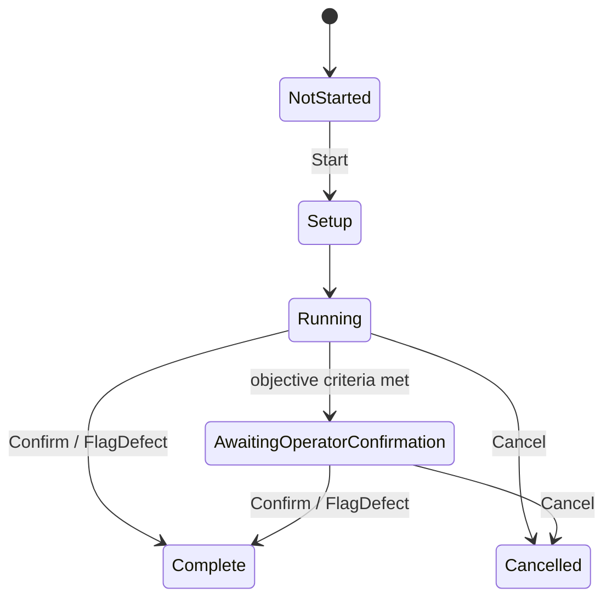

# Modules Summary

Five `ITestModule` implementations in `Core/Modules/`. All are discovered through
DI as `IEnumerable<ITestModule>` and coordinated by
[`../architecture/orchestrator.md`](../architecture/orchestrator.md).

## The contract

```csharp
public interface ITestModule
{
    IModuleMetadata Metadata { get; }
    string ModuleId { get; }
    ModulePhase CurrentPhase { get; }
    bool IsRunning { get; }
    IList<ModuleMeasurement> Measurements { get; }
    IList<string> Findings { get; }
    IList<string> OperatorActions { get; }
    bool CheckPreconditions();
    void Start(Action<TestStatus> onComplete);  // must return promptly
    void Cancel();
}
```

**Invariants**

- `Start` returns promptly; work happens asynchronously.
- `onComplete` fires **exactly once**.
- `Start` clears `Findings`/`Measurements`/`OperatorActions` — a restart
  is a clean slate, and anything recorded before `Start` is lost.
- `Cancel()` releases every OS resource, and so does the view model's `Dispose()`.



`ModulePhase` is the lifecycle position; `TestStatus` is the recorded verdict. They
are separate — see [`../reporting/status-vocabulary.md`](../reporting/status-vocabulary.md).

## The five modules

| Id | Display name | Exclusive | Max duration | Starts | Passes when | Lode |
|---|---|---|---|---|---|---|
| `keyboard` | Keyboard Test | yes | 30 min | on `Loaded` | confirm **and** all 104 keys pressed | [keyboard](keyboard.md) |
| `mouse` | Mouse Test | yes | 30 min | on `Loaded` | confirm (no coverage floor) | [mouse](mouse.md) |
| `monitor` | Monitor Test | yes | 30 min | on `Loaded` | confirm patterns render correctly | [monitor](monitor.md) |
| `system` | System Info | **no** | — | in the VM **constructor** | inventory collected | [system-info](system-info.md) |
| `stress` | CPU Stress Test | yes | 310s | **explicit Start** | full target duration elapsed | [cpu-stress](cpu-stress.md) |

`system` is the only non-exclusive module, so an inventory snapshot may overlap a
running keyboard test.

## Two trust models in one product

This is the central incoherence, and the operator has already complained about it
([`../../todo.md`](../../todo.md) item 1).

```csharp
// keyboard: coverage overrides the operator
if (missing.Count == 0) { status = TestStatus.Passed; }
else { status = TestStatus.Warning; }        // operator said OK; tool disagrees

// mouse: the operator is unconditionally right
cb = StopInternal(TestStatus.Passed, "Passed — operator confirmed all mouse functions work.");
// zero clicks, zero scrolls, zero drags still Passes
```

Keyboard coverage is the **only** objective pass criterion in the whole product.
Everything else is a perceptual check where architecture §5 says the operator's
confirmation *is* the status. One answer must apply to both — open decision
[D2](../plans/open-decisions.md).

## Patterns shared by all five

- **Terminal recording.** Every module funnels its ending through a private
  `StopInternal(status, detail)` that sets `CurrentPhase`, appends `detail` to
  `OperatorActions`, sends a status message on the bus, and returns the completion
  callback to be invoked outside the lock.
- **`FlagDefect` is how anything Fails.** No module auto-fails on missing coverage.
- **`CheckPreconditions()` returns `true` everywhere.** The gate exists but is never
  used, and declared `RequiredCapabilities` are never enforced.
- **`Artifacts` is gone.** The interface member and the model field were never
  populated by any module and were removed in roadmap A7.

## Known cross-module defects

| Defect | Detail |
|---|---|
| Two sub-screens measure the operator, not the hardware | WPM typing test and duck tracing. Neither affects any status; both leave raw capture running so they pollute coverage and counters. Roadmap A1/A2 |
| Operator defect note | Each screen has a "What's wrong?" field bound to `FlagDefect(note)`; blank notes fall back to the module's default wording. Cleared on Start/Reset. |
| Auto-start policy differs per module | Decided per implementation phase rather than as one decision. Only CPU stress documents its choice. Roadmap B3 |
| Keyboard has no device-loss handling | The mouse module subscribes to `DeviceTopologyChangedMessage` and records an honest disconnect finding; the keyboard does not, so an unplugged keyboard mid-test is unrecorded |
| Engineering vocabulary in findings | `BelowNormal`, `"(graceful)"`, `"sub-screen"`, `"duck"`, exception type names. Roadmap C5 |

## Adding a module

Four places must change today (roadmap E1 exists to reduce this to one):

1. The `ITestModule` implementation in `Core/Modules/`.
2. Two DI registrations in `App.ConfigureServices` — concrete singleton **and**
   `ITestModule` factory pointing at the same instance.
3. `DashboardViewModel.Modules` (hardcoded) and `NavigationService.NavigateToModule`
   (string switch).
4. A `DataTemplate` in `MainWindow.xaml` mapping the view model to its view.

Then add tests mirroring `Phase2ModuleTests.cs`: compose via DI, drive a fake,
assert the terminal status.
