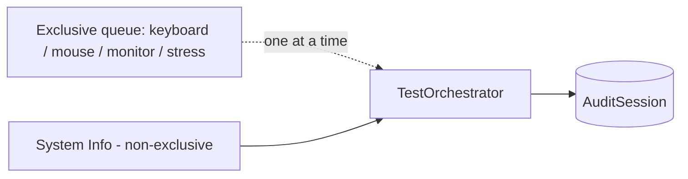

# System Info Module

`Core/Modules/SystemInfoModule.cs` + `App/ViewModels/SystemInfoModuleViewModel.cs`
+ `App/Views/SystemInfoView.xaml`. **The only non-exclusive module.** No max
duration.

**Purpose:** capture a machine inventory (CPU, RAM, disks, BIOS, OS) into the audit
record without the operator doing anything.

## Non-exclusive by design



An inventory snapshot may overlap a running keyboard test, because reading WMI does
not compete for the operator's attention or the input devices. It is the only
module for which the orchestrator's exclusivity gate does not apply.

## Collection

`Infrastructure/SystemInfoProvider.cs` queries WMI/CIM plus `DriveInfo`, all
without elevation, each query independently best-effort. `SystemInfoSnapshot`
carries the result. `Populate` then writes measurements:

```csharp
Add("Hostname", Environment.MachineName);
Add("Operating system", s.OsName);
Add("Physical cores", s.PhysicalCores?.ToString(), context: "cpu");
Add("Disk", $"{d.Model} — {d.SizeFormatted}", context: "storage");
```

Null fields are skipped rather than written as empty, so an unavailable value is
absent rather than fabricated.

## Pass criteria

| Outcome | Trigger |
|---|---|
| `Passed` | inventory collected |
| `Warning` | the whole collection threw — `$"System info collection failed: {ex.Message}"` |
| `Cancelled` | navigate away while running |

Summary finding:
`$"Inventory captured for {machine}: {cpu}, {ram}, {n} fixed disk(s)."`

## The auto-start that shapes every report

```csharp
// SystemInfoModuleViewModel constructor
_orchestrator.TryStartModule("system", out _);
```

This module starts from the **view-model constructor** — earlier than any other
module, which start on `Loaded` or on an explicit click. The operator only has to
open the screen.

**Consequence, and the most damaging defect in the product:** this is the easiest
session to produce, and it exports as

```
Overall status: Passed
| System Info | Passed | … |
```

with **no mention of the keyboard, mouse, monitor or CPU**, because
`HtmlReportTemplate` only iterates modules that were actually started. A machine
that was never really audited gets a green report. Roadmap C2.

A second consequence: because a `ModuleResult` is appended per *start*, visiting
this screen three times produces three identical sections with the same 11
measurements and no run number to distinguish them.

## Known defects

| Defect | Detail | Fix |
|---|---|---|
| Enables a green report for an unaudited machine | See above. | C2 |
| **UI and report disagree** | The screen shows `Max clock` and `BIOS manufacturer`; `Populate` records neither. Two fields the technician sees never reach the reader. Field order also differs. | C5 |
| Hostname duplicated | Recorded as a measurement *and* rendered in the report header. | C5 |
| 11 identical timestamps | Every measurement stamps `DateTime.UtcNow` at write time, so the table shows the same instant 11 times. | C5 |
| Passive-voice finding | `"Inventory captured for…"` is a different voice from every other module's operator-subject prose. | C5 |
| Raw exception text in a finding | `$"System info collection failed: {ex.Message}"` reaches the reader. | C5 |
| `Warning` overloaded | This module's `Warning` means "WMI threw"; the keyboard's means "operator confirmed with untested keys". Same colour, unrelated meanings. | A6/C3 |

## Tests

Coverage is thin and permissive. `Phase2ModuleTests` asserts only:

```csharp
Assert.True(result.Status is TestStatus.Passed or TestStatus.Warning);
```

which passes even if every WMI query threw. No test asserts a single inventory
measurement, the field set, the labels, or the summary finding — which is why the
UI/report divergence above went unnoticed. `SystemInfoProvider` has no direct test.
