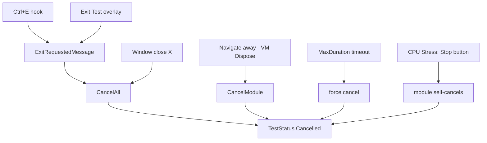

# Open Decisions

> **RESOLVED 2026-08-31.** The owner answered all three. The decisions are
> binding and are implemented in the roadmap phases noted below. The original
> analysis below is kept for context.

## D1 — What does leaving a test mean? → **RESOLVED: option (a), leaving is a non-event**

Leaving a test records **nothing** in the report: the operator decided not to do
that test now, and not all tests are mandatory. Only a deliberate abort (Ctrl+E
/ Exit Test) writes `Cancelled`. Implemented in
[roadmap.md](roadmap.md) Phase 2 (B1, B3). The burn-in Stop button records
`Passed` with the achieved duration, not `Cancelled`.

## D2 — Is operator judgment authoritative, or is coverage? → **RESOLVED: option (a), operator is authoritative**

If the operator reports the device broken, it is broken. Coverage is a reported
measurement, never a verdict that overrides them. No coverage floor for the
mouse; the keyboard's current behaviour (finding, not `Warning`) is the model
everywhere. Implemented/verified in roadmap Phase 3 (B2).

## D3 — Does the tool need crash recovery at all? → **RESOLVED: no — delete it**

`SessionCheckpointStore`, `ISessionCheckpointStore`, the four write sites, the
DI registration and both test files are removed. Roadmap Phase 1 (A3).

---

## Original analysis (context only)

Three questions the codebase currently answers inconsistently or not at all. Each
blocks specific roadmap work. **The human decides these; do not pick one silently
while implementing something else.**

---

## D1 — What does leaving a test mean?

**Current behaviour.** Every exit path funnels through
`ExitRequestedMessage → App.HandleExitRequested → orchestrator.CancelAll()` and
records `TestStatus.Cancelled`.



So one word covers five materially different situations, and three of them share
the identical finding `"Cancelled by operator."` The worst case is the CPU stress
**Stop** button: a deliberate 30-second smoke test is recorded exactly like an
abandoned run.

The operator-visible symptom is [`../../todo.md`](../../todo.md) item 2 — on the
fullscreen pattern window, "Back to controls" and "Exit Test (Ctrl+E)" sit
adjacent, look equivalent, and produce opposite report outcomes.

**Options**

| | Approach | Consequence |
|---|---|---|
| a | Leaving a screen is a non-event; only `Ctrl+E` aborts | Simplest. A started-but-unfinished module needs some status — probably `NotRun` or a new `Incomplete` |
| b | Leaving records `NotRun` and removes the `ModuleResult` | Keeps the vocabulary small; loses the fact that the operator looked |
| c | Split `Cancelled` into `Aborted` vs `StoppedEarly` | Most expressive; grows the vocabulary that D3-adjacent work is trying to shrink |

**Blocks:** roadmap B1, B3, and part of C2. Interacts with A6 (status removal).

**Constraint that must survive any choice:** the §6 guarantee that a mouse-only
and a keyboard-only exit are each independently sufficient from every screen. That
principle is not up for renegotiation — only the *recorded meaning* of using it.

---

## D2 — Is operator judgment authoritative, or is coverage?

**Current behaviour.** The two modules answer oppositely.

```csharp
// KeyboardTestModule.Confirm — coverage overrides the operator
if (missing.Count == 0) { status = TestStatus.Passed; }
else { status = TestStatus.Warning; }   // operator said OK; tool disagrees

// MouseTestModule.Confirm — the operator is unconditionally right
cb = StopInternal(TestStatus.Passed, "Passed — operator confirmed all mouse functions work.");
// zero clicks, zero scrolls, zero drags still Passes
```

The operator has already complained about the keyboard half
([`../../todo.md`](../../todo.md) item 1): they confirmed the keyboard works and
the tool recorded `Warning` anyway.

Note that keyboard coverage is the **only** objective pass criterion in the whole
product. Everything else — monitor uniformity, mouse function, tracing — is
explicitly a perceptual check where architecture §5 says the operator's
confirmation *is* the status.

**Options**

| | Approach | Consequence |
|---|---|---|
| a | Operator is authoritative everywhere; coverage becomes a reported measurement, not a verdict | Resolves `todo.md` 1 directly. Consistent with §5. Requires recording coverage as a measurement so the reader still sees it |
| b | Coverage is authoritative everywhere | Mouse needs a coverage floor (all buttons + both scroll directions + a drag). Contradicts §5 for perceptual checks, and cannot be applied to the monitor at all |

**Blocks:** roadmap B2. Also shapes C2 (what a partial module means) and C4 (if the
operator can describe a defect, the case for overriding them weakens further).

**Note:** whichever is chosen, the mouse module currently emits `Warning` from no
code path, so `MouseTestModuleViewModel`'s `Warning` arm is dead either way (A8).

---

## D3 — Does the tool need crash recovery at all?

**Current behaviour.** `ISessionCheckpointStore` exposes exactly one method,
`Save`. It is called from four sites (after every module completes, on cancel, on
`Dispose`, and explicitly on window close). **Nothing ever reads a checkpoint
back.** There is no `Load`, no enumeration, no recovery prompt, no cleanup. The
only reader in the repository is `SessionCheckpointTests`.

Files accumulate in `%LOCALAPPDATA%\HardwareAuditToolkit` forever — one
`audit-<guid>.hat.json` per launch, since every launch mints a fresh `SessionId`.

Ironically the unread checkpoint is the *most complete* artifact the tool
produces: the final `Save` runs from `TestOrchestrator.Dispose()` during service
disposal, i.e. after `CompletedAt` is set and after any export recorded its paths.
The exported report the technician actually hands over has neither.

**Options**

| | Approach | Consequence |
|---|---|---|
| a | Delete it | Removes four call sites, an interface, a class and two test files. The stated guarantee disappears, but it was never real |
| b | Implement recovery | `App.OnStartup` probes for prior checkpoints and offers "resume/export previous session". Also needs retention/cleanup |

**Not an option:** leaving it write-only. That is pure complexity cost with zero
user-facing value.

**Blocks:** roadmap A3.

**Related fix regardless of choice:** the ordering bug that makes the checkpoint
more correct than the export is roadmap C1 — stamp `CompletedAt` before
serialising. Fixing C1 removes the irony but not the question.
