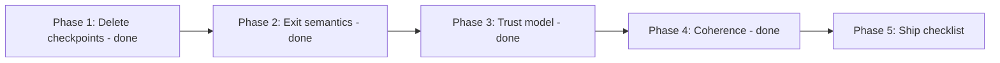
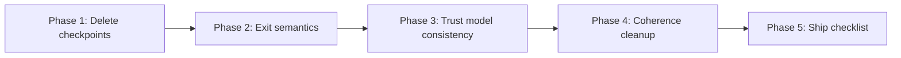

# Roadmap — Implementation Plan (next work)

Rebuilt 2026-08-31 after the owner resolved all three open decisions
([open-decisions.md](open-decisions.md), §"Resolved"). Supersedes the original
Pass A–E ordering. Based on the tree at commit `0386903` ("C1–C9 all done").

**Status: Phases 1–4 are DONE** (landed 2026-08-31). What remains is Phase 5
(manual pre-ship work) and the owner-deferred v2 list. The build is zero-warning
with **78 xunit tests passing**.

- **Phase 1 (done):** checkpoint store deleted (D3).
- **Phase 2 (done):** leaving is a non-event — `StopModule`/`StopAll` (non-recording)
  used by navigation disposal and window close; only Ctrl+E / Exit Test aborts and
  records `Cancelled`; CPU-stress Stop resolves `Passed` with the achieved duration
  (`CpuStressModule.CompleteEarly`); one documented auto-start policy (explicit Start
  for the four exclusive tests; System Info collects on screen open); unattended
  timeout keeps `Cancelled` (documented in
  [`../reporting/status-vocabulary.md`](../reporting/status-vocabulary.md)).
- **Phase 3 (done):** operator is authoritative everywhere — verified no path
  overrides/downgrades a Confirm/FlagDefect; coverage is a measurement in findings;
  tests added for zero-evidence Confirm (keyboard + mouse) and defect-note-to-record.
- **Phase 4 (done):** E1 dashboard built from `TestOrchestrator.Modules` metadata +
  `ModuleScreenRegistry` replacing the routing switch; E2 persistent header in
  `MainWindow.xaml` (Back/Export/Exit), per-view overlays and Back buttons deleted
  (`ExitOverlay` control removed); E3 per-module status text on dashboard cards;
  E4 `schemaVersion: 1` in the JSON, golden files regenerated; README rewritten.

**Already landed and no longer planned:** Pass A subset (A4/A6/A7/A8), all of
Pass C (C1–C9, including the report DTO `ReportModel` and golden-file tests),
all of Pass D (display sleep, sensor reason, graph fill). A1/A2 (WPM + duck
sub-screens) and A5 (dashboard badge) are **deferred by owner — do not do them**.

What remains is exactly the work the three decisions unblocked, plus the
coherence cleanup. Nothing below is a new feature.

**UPDATE (2026-08-31, later session): Phases 2–4 have landed.** The detailed
phase sections below are kept as the original specification; the current
behaviour is described in `architecture/exit-and-navigation.md`,
`reporting/status-vocabulary.md`, `modules/*` and the source itself.

---

## Phase 1 — Delete the checkpoint store (A3, decided: no crash recovery) — **Done**

Landed 2026-08-31: `SessionCheckpointStore`, `ISessionCheckpointStore`,
`CheckpointSession()`, the four write sites, the DI registration and both
checkpoint test files removed. Builds with zero warnings; 68 tests pass; no
checkpoint reference remains in `Src/`.

## Phase 2 — Exit semantics: leaving is a non-event (B1 + B3, decided D1)

The rule from D1: **leaving a test records nothing.** It means the operator
decided not to do that test now. Not all tests are mandatory. Only a deliberate
abort writes a status.

1. **Navigate-away is a non-event.** View-model `Dispose` / navigation away
   stops a running module *without* appending a `ModuleResult` or writing a
   finding. Today `CancelModule` records `Cancelled`; add a non-recording stop
   path (e.g. `StopModule` vs `AbortModule`) in `TestOrchestrator` and use it
   from navigation disposal.
2. **Window close / app exit is a non-event.** `App.OnMainWindowClosing` and
   `HandleExitRequested` currently `CancelAll()` → `Cancelled`. On shutdown
   the report never gets read, so use the non-recording stop everywhere except
   the one true abort (below).
3. **Ctrl+E is the only abort.** The `ExitRequestedMessage` path records
   `Cancelled` only when invoked from the Ctrl+E hook / Exit Test affordance.
   The §6 guarantee (mouse-only and keyboard-only exit both independently
   sufficient) is unchanged — only the recorded meaning differs.
4. **Burn-in early stop.** The CPU stress Stop button ending a deliberate
   30-second smoke test must not read `Cancelled`. Record `Passed` with a
   finding stating the achieved duration — prefer reusing `Passed` over adding
   a `StoppedEarly` status, to keep the vocabulary small.
5. **Monitor pattern window.** Keep the current mitigation (overlay collapsed,
   "Back to controls" only, Ctrl+E still aborts); now it matches the rule
   instead of patching over it.
6. **Auto-start policy (B3).** Stop `MonitorTestView` auto-starting on load.
   With leaving-as-a-non-event, auto-start + immediate leave writes nothing,
   but auto-start still hides "not run" from the operator. Decide one policy
   for all five modules and write the reasoning in a comment, as
   `CpuStressView.xaml.cs` already does.
7. **Unattended timeout** (`MaxDuration`) records `Cancelled` today. Decide:
   timeout is an abort → keep `Cancelled`; document the choice in
   `lode/reporting/status-vocabulary.md`.

**Acceptance:** open each module screen, leave immediately, export — the report
shows that module as `NotRun` with no `Cancelled` row and no finding. Ctrl+E
from every screen still records `Cancelled`. A 30 s stress run reads `Passed`,
not `Cancelled`. Update `lode/architecture/exit-and-navigation.md`,
`lode/reporting/status-vocabulary.md`, and the module files' state machines.

## Phase 3 — Operator is authoritative (B2, decided D2)

The keyboard module already implements this: `Confirm` passes regardless of
coverage; missing keys are a finding, not a `Warning`. Verify and finish the
consistency:

1. Grep every module for any path where a computed value overrides or
   downgrades the operator's `Confirm`/`FlagDefect` decision. There must be none.
2. Coverage appears in the report as a **measurement** (presses/expected,
   clicks, scroll ticks), never as a verdict word ("insufficient"). Verify in
   the golden files and the `ReportModel` mapping — the C2/C3 work likely
   already does this.
3. Add/extend tests: `Confirm()` with zero evidence returns `Passed` for mouse
   and keyboard; `FlagDefect` with a note returns `Failed` and the note reaches
   the report.

**Acceptance:** no module can override the operator; coverage numbers visible in
the HTML for every confirm; golden files show a measurement, not a judgement.

## Phase 4 — Coherence cleanup (E1–E4)

Ordered smallest-first:

| # | Action |
|---|---|
| E1 | Single source of truth for the module list: build the dashboard from `TestOrchestrator.Modules` / `IModuleMetadata`; delete the hardcoded list in `DashboardViewModel` and the routing `switch` in `NavigationService` |
| E2 | Persistent header in `MainWindow.xaml` carrying Export + Exit; delete the copy-pasted `ExitOverlay`/"Back to dashboard" pairs from the six views. Then make `README.md` / `Src/README.md` describe current state truthfully |
| E3 | Per-module status on dashboard cards so the operator sees the audit's shape (what ran, what passed, what's left) before exporting. Feed from the same `IModuleMetadata` source as E1 |
| E4 | `schemaVersion` field in the JSON (add to `ReportModel` / serializer; regenerate the golden JSON files in the same commit) |

**Acceptance:** adding a sixth module touches exactly one place; one shared
exit/export chrome; dashboard shows status per module; golden JSON carries
`schemaVersion`.

## Phase 5 — Pre-ship checklist (cannot be done in code)

- Authenticode code-signing via the org PKI.
- An EDR pass (e.g. Microsoft Defender for Endpoint) before wide rollout.
- Manual walk of every exit path from every screen, including mid-CPU-stress,
  verifying the Phase 2 semantics hold.
- On-hardware verification: every physical key registers; patterns render at
  correct scale on mixed-DPI multi-monitor; USB write-test cascade with a real
  stick.

## Not in scope (owner-deferred / v2)

WPM and duck sub-screen removal (A1/A2 — features kept), dashboard badge
cleanup (A5), admin-mode sensor detail, audio/network/USB modules, non-US
layouts, CLI mode, cross-session history, code-signing tooling.
