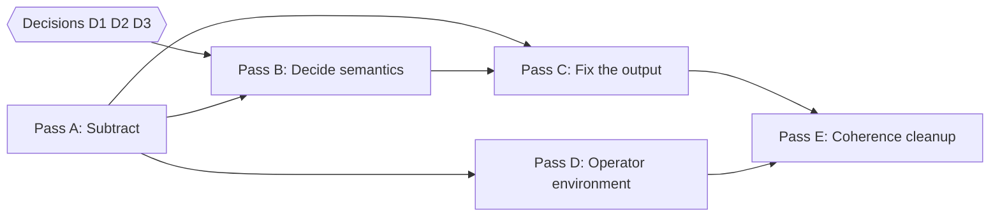

# Roadmap

Derived from [`../../taste-audit.md`](../../taste-audit.md). Ordered so cheap,
reversible subtraction lands before decisions, and the output is corrected before
any new surface is added.

All feature work from the architecture document is complete. **Nothing on this
roadmap is a new feature.** It is removal, correction and one missing field.

## Pass A — Subtract

Aimed at "no decisions required, all cheap to reverse." Status reflects the owner's
re-scope (landed 2026-08-28): **keep the two sub-screens as features; remove only
stale/unused code.** A1/A2 are therefore deferred, A3 waits on D3, and A5 (visible
UI) is skipped.

| # | Action | Primary files | Status |
|---|---|---|---|
| A1 | Delete the WPM sub-screen and `KeyboardTestModule.RecordWpm` | `KeyboardTestModuleViewModel.cs`, `KeyboardTestView.xaml`, `KeyboardTestModule.cs` | **Deferred** — feature kept |
| A2 | Delete the duck-tracing sub-screen and `MouseTestModule.RecordTrace` | `MouseTestModuleViewModel.cs`, `MouseTestView.xaml(.cs)`, `MouseTestModule.cs` | **Deferred** — feature kept |
| A3 | Delete the write-only checkpoint store **or** implement the resume prompt. Do not leave it write-only. | `Core/SessionCheckpointStore.cs`, `Core/ISessionCheckpointStore.cs`, `TestOrchestrator.cs`, `App.xaml.cs` | Pending — needs [D3](open-decisions.md) |
| A4 | Delete `ModulePlaceholderViewModel`/`View` and the `NavigationService` default arm | `ViewModels/`, `Views/`, `MainWindow.xaml`, `NavigationService.cs` | **Done** — unknown id now throws |
| A5 | Remove the `exclusive` badge and raw `Category` line from dashboard cards | `DashboardHomeView.xaml`, `DashboardItemViewModel.cs` | **Deferred** — renders visible UI; owner skipped |
| A6 | Remove `Skipped` and `Unsupported` from `TestStatus` and their read sites; drop the dead aggregation arm | `IModuleMetadata.cs`, `TestOrchestrator.cs`, `HtmlReportTemplate.cs`, `MonitorTestModuleViewModel.cs` | **Done** |
| A7 | Remove the Notes and Artifacts template branches and the unused model members; `MachineId` is populated by SystemInfoModule | `HtmlReportTemplate.cs`, `AuditSession.cs`, `ITestModule.cs`, 5 modules, `TestOrchestrator.cs` | **Done** — full `Artifacts` chain removed |
| A8 | Remove the unreachable mouse `Warning` arm and the stale `duck/bicycle` comment | `MouseTestModuleViewModel.cs` | **Done** |

**Acceptance:** zero warnings; `dotnet test` green; no `TestStatus` member without
a write site; no interface with a write-only method. Met for the landed subset
(A4/A6/A7/A8): builds with 0 warnings, 61 tests pass, and `Artifacts`/`Notes`/
`Skipped`/`Unsupported` have no remaining source references.

**Rationale:** the sub-screens measure the *operator* (typing speed, hand
steadiness), not the hardware, and neither affects any status. Worse, both leave
raw capture running, so typing the WPM pangram silently fills the keyboard
coverage metric that decides Pass vs `Warning`. The owner has chosen to keep them
for now (A1/A2 deferred); see [`../modules/keyboard.md`](../modules/keyboard.md) and
[`../modules/mouse.md`](../modules/mouse.md).

## Pass B — Decide the semantics

Blocked on [`open-decisions.md`](open-decisions.md).

| # | Action | Needs |
|---|---|---|
| B1 | Split "leave this screen" from "cancel this test"; give the fullscreen pattern window only the former. Resolves `todo.md` 2. | D1 |
| B2 | Apply one trust model to all modules. Resolves `todo.md` 1. | D2 |
| B3 | Align auto-start policy across all five modules and record the reasoning in a comment, as `CpuStressView.xaml.cs` already does | D1 |

## Pass C — Fix the output

The report is the product. This pass is the highest-value work in the plan.

| # | Action |
|---|---|
| C1 | Stamp `CompletedAt` **before** serialisation; derive the filename from export time so re-export never overwrites |
| C2 | Render **every** module including untested ones, and lead with counts. A partial audit must never read `Passed`. |
| C3 | Introduce a report DTO between `AuditSession` and both writers, with status display names, so raw enums and internal tags stop reaching the reader |
| C4 | Wire `FlagDefect(note)` to a real text field on all three screens — the highest-value missing field in the product |
| C5 | Normalise finding voice; route internal diagnostics out of `Findings` into `IDiagnosticLog` |
| C6 | Surface export failure honestly; stop returning `true` when the clipboard write threw |
| C7 | Show the HTML path as the primary "Saved to" line — the HTML is the human deliverable |
| C8 | Golden-file HTML and JSON for four sessions: empty, one-module, mid-run, full-with-defect. Add an escaping test. |
| C9 | Show local time alongside UTC |

**Acceptance:** an export with nothing run reads unmistakably as "nothing was
audited"; an export with one module run names the four that were not; no raw enum
identifier, internal tag or exception type name appears in either artifact.

## Pass D — Operator environment

The three complaints in [`../../todo.md`](../../todo.md) item 3.

| # | Action |
|---|---|
| D1 | Block display sleep for the duration of a burn-in (`ES_CONTINUOUS \| ES_DISPLAY_REQUIRED \| ES_SYSTEM_REQUIRED`), cleared on stop/cancel/dispose |
| D2 | Explain *why* temperature is unavailable — surface the sensor-open failure and show "run as administrator for core temperatures" instead of a bare `N/A` |
| D3 | Make the telemetry graph fill available width instead of guttering |

## Pass E — Coherence cleanup

Only after A–D.

| # | Action |
|---|---|
| E1 | Single source of truth for the module list: build the dashboard from `IModuleMetadata` and delete the hardcoded list and the routing `switch` |
| E2 | A real persistent header in `MainWindow.xaml` carrying Export + Exit; delete the six copy-pasted overlay/back-button pairs |
| E3 | Per-module status on the dashboard so the operator can see the audit's shape before exporting |
| E4 | Add a `schemaVersion` field to the JSON |

## Not in scope (deferred to v2)

Admin-mode opt-in with full sensor detail and automatic thermal cutoff;
audio/mic/webcam/battery/network/USB modules; non-US keyboard layouts; silent/CLI
unattended mode; cross-session history and trend comparison; code signing and
AV/EDR allow-listing.

## Manual pre-ship checklist

Cannot be satisfied in code:

- Authenticode code-signing via the org PKI.
- An EDR pass (e.g. Microsoft Defender for Endpoint) before wide rollout.
- A manual walk of every exit path from every screen, including mid-CPU-stress.
- On-hardware verification that every physical key registers, and that patterns
  render at correct scale on a mixed-DPI multi-monitor setup.
