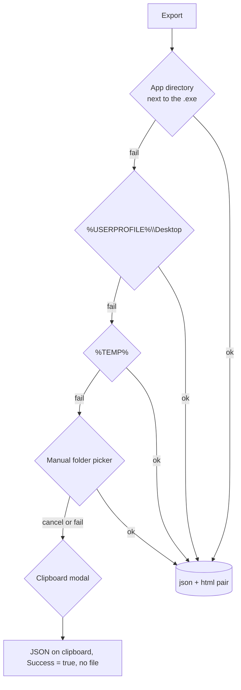

# Export Cascade

Architecture §9.6. **A failure partway down the cascade delays the export; it never
loses the audit.** The session stays in memory until a write actually succeeds.

`Core/Reporting/SessionExporter.cs` (pure) + `App/Services/ReportExportService.cs`
(Windows interactions). The current export flow treats invalid directories as a
probe failure, not an exception, and keeps the same serialized JSON payload for
any clipboard fallback or eventual file write.

## The five steps



Steps 1–3 are supplied by `ReportExportService.BuildPreferredDirectories()`; steps 4
and 5 are injected delegates so Core needs no UI reference.

## Probe before writing

The heart of the design — a throwaway file is written and deleted before the real
payload, so a vanished volume is detected while the data is still safely in memory:

```csharp
Directory.CreateDirectory(resolved);
string testFile = Path.Combine(resolved, $".hat_writetest_{Guid.NewGuid():N}.tmp");
File.WriteAllText(testFile, "ok");
File.Delete(testFile);

jsonPath = Path.Combine(resolved, baseName + ".json");
htmlPath = Path.Combine(resolved, baseName + ".html");
File.WriteAllText(jsonPath, json);
File.WriteAllText(htmlPath, html);
```

On any failure, partial files are deleted and the cascade moves on. Invalid
preferred directories are now filtered out by `TryResolvePaths()` instead of
throwing, so the cascade continues to the manual picker or clipboard path without
crashing the app. Apply this shape to any new durable write.

## The Core/App seam

```csharp
var options = new ReportExportOptions
{
    PreferredDirectories = BuildPreferredDirectories(),
    RequestManualFolder  = ShowFolderPicker,      // App: OpenFolderDialog
    ShowClipboardFallback = ShowClipboardFallback, // App: Clipboard + MessageBox
};
var result = _exporter.Export(_session, options);
```

`ReportExportService` also has an `internal` constructor taking an options override
so tests can exercise the "every directory unwritable" branch without WPF dialogs.
That seam is why the cascade is testable at all — keep it.

## Filename

```csharp
DateTime stamp = session.StartedAt == default ? DateTime.UtcNow : session.StartedAt;
return $"{host}_{stamp:yyyyMMddHHmmss}";
```

Invalid filename characters in the hostname are replaced. **Because the stamp is
`StartedAt`, not export time, re-exporting overwrites the earlier pair** — export,
run one more test, export again, and the first artifact is gone. Roadmap C1.

## Known defects

### The `CompletedAt` ordering bug (roadmap C1)

```csharp
// SessionExporter.Export
string json = JsonSerializer.Serialize(session, JsonOptions);  // ← completedAt still null
string html = _template.Render(session);                       // ← renders "in progress"

// ReportExportService.Export — too late
var result = _exporter.Export(_session, options);
if (result.Success && _session.CompletedAt is null) { _session.CompletedAt = DateTime.UtcNow; }
```

Every first export declares itself unfinished. `session.JsonPath`/`ReportPath` are
likewise set in `Succeed()` *after* serialisation, so the exported JSON always
reports `null` paths.

### Failure is invisible to the operator (roadmap C6)

```csharp
// DashboardViewModel
var result = reportExport.Export();
if (result.Success && result.JsonPath is not null) { ExportResultDialog.ShowResult(result); }
```

Three consequences:

- **A hard failure shows nothing at all** — no dialog, no message.
- The clipboard path returns `Success = true` with `JsonPath == null`, so it fails
  this guard; the dialog's own amber clipboard line is unreachable in production.
  The clipboard case is instead announced by a separate `MessageBox` inside the
  service, in different wording and a different visual language.
- `ShowClipboardFallback` **returns `true` even when `Clipboard.SetText` threw**, so
  the operator can be told the data is on the clipboard when it is not — and
  `Success` is still reported as `true`. The genuine hard-failure branch
  (`NoWritableLocation`) is therefore unreachable from the app and only exercised
  through the test seam.

### Other gaps

| Defect | Detail |
|---|---|
| `ReportExportResult.Message` is never read | The exporter sets four distinct messages; no consumer exists. The dialog hardcodes its own strings. |
| `ExportFailureReason.UserCancelled` is never assigned | Cancelling the picker falls through to clipboard/`NoWritableLocation`. |
| Picker exceptions escape | `picker()` is called outside any `try`; a throwing dialog reaches `DispatcherUnhandledException`, which logs and sets `Handled = true` — the operator sees nothing. |
| The dialog leads with the JSON path | The HTML is the human deliverable; it is only reachable via the `Open Report` button. Roadmap C7. |
| `Open Report`/`Open Folder` failures are swallowed | If the browser fails to launch, the button appears to do nothing. |
| Export lives only on the dashboard | There is no persistent header, despite the README having claimed one. Roadmap E2. |
| Dialog contrast | Light foregrounds with no window background set, so text renders near-white on white. |

## Tests

`ReportExportTests.cs` (7) covers the cascade well: writes the pair, JSON
round-trip, picker fallback, clipboard fallback, total failure, null-arg guards.
`ReportExportServiceTests.cs` (4) covers the App-layer cascade and `CompletedAt`
semantics.

Note `ReportExportServiceTests` writes into the **live application directory** — the
real first cascade candidate — and deletes afterwards, so it leaves files behind if
it fails mid-test.

**Untested:** `ExportResultDialog` entirely, `DashboardViewModel.ExportReport`'s
guard, and `ShowClipboardFallback`'s unconditional `true`. All three are where the
defects above live.
