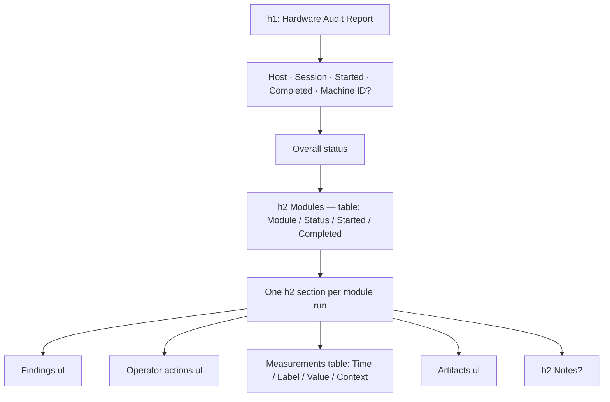

# HTML Report

`Core/Reporting/HtmlReportTemplate.cs`, behind `IReportTemplate`. A single
self-contained, printable HTML file with inline CSS and a `@media print` rule. Zero
dependencies — the file opens in any browser on a machine with nothing installed.

## Structure



Every section after Findings is conditional on having content.

## Safety and formatting helpers

```csharp
private static string Enc(string? s) => WebUtility.HtmlEncode(s ?? string.Empty);
private static string Fmt(DateTime d) => d.ToString("u");        // 2026-08-19 10:00:00Z
private static string StatusClass(TestStatus s) => s switch { … }; // pass/fail/warn/na
```

**All interpolation goes through `Enc`**, so a hostile hostname or finding cannot
inject markup. Keep it that way — and note no test currently proves it, so an
escaping test is part of roadmap C8.

`StatusClass` maps eight statuses onto five CSS classes; `Running` and `Skipped`
both fall through to the grey `na` bucket, so **a module still running at export
time is coloured identically to one never run.**

## What leaks to the reader

| Leak | Example |
|---|---|
| Raw enum identifiers | `NotRun` (not "Not run"); headings read `Keyboard Test — NotRun` |
| Internal context tags | Measurements table `Context` column: `cpu`, `storage`, `wpm`, `trace`, `pattern`, or `-` |
| .NET exception type names | `"Burn-in worker failed (InvalidOperationException): …"` |
| Method names | `"Module.Start threw an exception; the module failed before it could begin."` |
| Thread priorities | `"…on 8 logical cores at BelowNormal priority…"` |
| UI implementation terms | `"Operator confirmed without running the tracing sub-screen."` |
| App-behaviour asides | `"…drag/drop incomplete (graceful)."` |
| Internal target names | `"Tracing test (duck): 87.5% path coverage…"` |
| Raw `TimeSpan` | `"…maximum duration of 00:30:00 and was force-cancelled."` |
| Zero-based internal index | `"Display 0: Dell U2718Q (3840x2160, primary)"` |

Roadmap C3 introduces a report DTO with status display names so this stops at the
boundary; roadmap C5 rewrites the finding text itself.

## Dead branches

Three sections exist in the template and can never render, because nothing ever
populates their source:

- **Machine ID** — `AuditSession.MachineId` is never assigned anywhere.
- **Notes** — `AuditSession.Notes` is never assigned; no UI field exists.
- **Artifacts** — zero `Artifacts.Add` calls in the solution.

Roadmap A7. `MachineId` is the one worth keeping: architecture principle 5 promises
a "machine-identified" record, and System Info is the natural place to set it.

## What the document does not say

These are omissions, not bugs, and they are what make the report hard to trust:

- **No roster of untested modules.** The template iterates `session.Modules`, which
  only contains modules that were *started*. A machine whose mouse was never tested
  produces a report with **no mention of a mouse** — indistinguishable from the tool
  not having a mouse test. Combined with System Info's auto-start, this is how an
  unaudited machine gets `Overall status: Passed`. Roadmap C2, the highest-value fix
  in the plan.
- **No summary counts.** One collapsed enum for the whole session; nothing says
  "4 of 5 passed, 1 cancelled".
- **No tool identity.** No product name, no version, no build id.
- **No operator identity and no reason-for-audit.** The only identity is hostname
  plus a GUID.
- **No local time.** UTC only, so timestamps never match the technician's wall
  clock. Roadmap C9.
- **No way to distinguish duplicate runs** of the same module.

## Empty and partial states

Nothing run:

```
Hardware Audit Report
Host: WS-01   Session: 8f3c…   Started: 2026-08-28 09:50:08Z   Completed: in progress
Overall status: NotRun
Modules
| No modules were run in this session. |    ← colspan=4, class="na"
```

That sentence is the one deliberate empty-state string in the codebase. But the
framing is otherwise identical to a completed audit — same title, header and table
chrome — so it reads as a blank form with a filled-in letterhead, and it is still
written as a fully-named, official-looking file pair.

Mid-run: the module row shows `Running` with `-` for completion, and the detail
section renders as **a bare heading with nothing under it**, because findings and
measurements are copied into the `ModuleResult` only at completion. Real
already-collected data — keys pressed, patterns viewed — is absent.

## Tests

One:

```csharp
[Fact]
public void HtmlReportTemplate_RendersHostnameAndModule()
{
    var html = new HtmlReportTemplate().Render(BuildSession());
    Assert.Contains("TESTHOST", html);
    Assert.Contains("Keyboard Test", html);
    Assert.Contains("<html", html);
    Assert.Contains("All keys registered.", html);
}
```

Untested: the empty-modules branch, the "in progress" vs completed branch, the
measurements table, operator actions, artifacts, notes, the Machine ID branch,
`StatusClass` for any status, `Enc` escaping, and `Fmt`.

There is **no golden/approval file**, so any wording or layout change is invisible to
CI. Roadmap C8 adds golden files for four sessions — empty, one-module, mid-run,
full-with-defect — plus an escaping test. Do that **before** changing wording.
