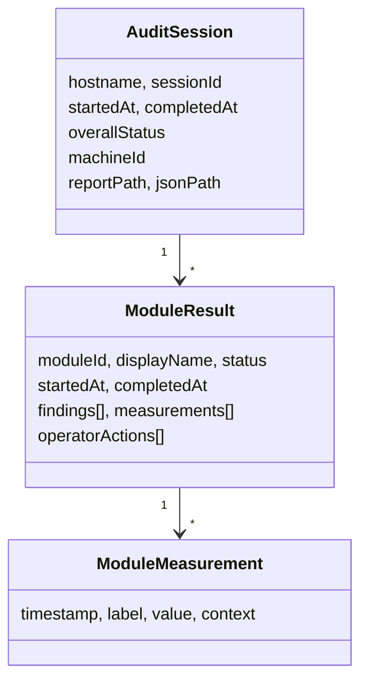

# Session Model

`Core/AuditSession.cs`. The in-memory record of one audit, and — because the JSON
export is a direct serialisation of it — also the public JSON contract.

## Shape



Every property carries an explicit `[JsonPropertyName]`, so renaming a C# property
does not break the contract. `TestStatus` serialises as a **string** via
`JsonStringEnumConverter`, so reordering the enum cannot silently change meaning.

## Lifecycle

The session is created **eagerly at DI configuration time**:

```csharp
var session = new AuditSession
{
    SessionId = Guid.NewGuid().ToString("N"),
    Hostname = Environment.MachineName,
    StartedAt = DateTime.UtcNow,
};
services.AddSingleton(session);
```

So a session with an id, hostname and start time exists from launch, before any test
runs — which is why exporting an empty audit is a normal one-click outcome.

`CompletedAt` is set in exactly two places:

- `App.OnMainWindowClosing`, on native close;
- `ReportExportService.Export`, **after** the exporter has already serialised.

That second one is the ordering bug behind
[`summary.md`](summary.md) defect 2 (roadmap C1).

## One result per start, not per module

`TestOrchestrator.TryStartModule` **appends** a `ModuleResult`. Restarting appends a
second. Findings and measurements are copied from the module into the result only at
completion, so:

- a mid-run export shows a `Running` row with an empty detail section;
- visiting the System Info screen three times produces three identical sections
  with no run number.

See [`../architecture/orchestrator.md`](../architecture/orchestrator.md).

## Field-by-field state

| Field | Populated? | Notes |
|---|---|---|
| `hostname` | yes | also duplicated as a System Info measurement |
| `sessionId` | yes | bare 32-char GUID; nothing else references it |
| `startedAt` | yes | UTC |
| `completedAt` | **null on first export** | ordering bug, roadmap C1 |
| `modules[]` | yes | only modules that were *started* |
| `overallStatus` | yes | precedence-collapsed, see [status-vocabulary](status-vocabulary.md) |
| `machineId` | yes | set by `TestOrchestrator` from the System Info module's snapshot (`Win32_ComputerSystemProduct.UUID`, falling back to BIOS serial number) |
| `reportPath` / `jsonPath` | **null in the exported JSON** | set by `Succeed()` *after* serialisation, so the file always reports null paths |

`notes` and `artifacts[]` no longer exist — they were never populated and were removed
in roadmap A7; `machineId` is populated by the System Info module.

## `ModuleMeasurement.Context`

Intended as disambiguation ("which core", "which key"). In practice it holds
lowercase internal tags — `"cpu"`, `"storage"`, `"wpm"`, `"trace"`, `"pattern"` —
and is null about half the time, rendering as `-`. It is meaningless to a reader.
Roadmap C3 should either give it a reader-facing purpose or drop it from the
rendered output.

## `Findings` is unstructured

```csharp
public List<string> Findings { get; set; } = [];
```

No severity, no key, no category. Consequently the same list mixes operator
attestations, measured results, and internal failure text authored by the
orchestrator (`"Module.Start threw an exception…"`). Four distinct voices end up
side by side. Roadmap C5.

`OperatorActions` is currently a near-verbatim restatement of `Status` for
keyboard/mouse/monitor and empty for the other two, so the report's section shape
differs per module for no reason a reader could infer.

## JSON vs HTML divergence

The JSON is a raw dump — `JsonSerializer.Serialize(session, WriteIndented)` with no
report DTO — so the two artifacts differ in ways nobody chose:

| | JSON | HTML |
|---|---|---|
| `schemaVersion` | `1` (roadmap E4 — bump on any breaking shape change) | n/a |
| `moduleId` | present | omitted |
| `machineId` | emitted as `null` | omitted |
| Empty session | prose-status entries for the full roster | prose: "No modules were run in this session." |
| Timestamps | ISO round-trip | `"u"` format, UTC only |

Roadmap C3 introduced the shared report DTO so both writers render one deliberate
shape; E4 added `schemaVersion` as the first JSON field.

## Rules

1. Adding a property means adding `[JsonPropertyName]` — the contract is explicit.
2. Do not add a field the UI cannot populate. A7 deleted the two that existed
   (`notes`, `artifacts`); `reportPath`/`jsonPath` stay null-in-export until roadmap
   C1/C7.
3. `Findings` text is read by someone who never saw the machine. Internal
   diagnostics belong in `IDiagnosticLog`.
