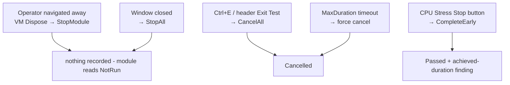

# Status Vocabulary

`TestStatus` in `Core/IModuleMetadata.cs`. Six members. Two — `Skipped` and
`Unsupported` — were never assigned anywhere and were removed in roadmap A6.

**Read this before touching any module's terminal status.** The vocabulary is the
single most incoherent thing in the product, and every reporting fix depends on
settling it.

## What is actually produced

| Status | Produced by | Notes |
|---|---|---|
| `NotRun` | default only | session-level when nothing has completed |
| `Running` | orchestrator, at start | visible in a mid-run export |
| `Passed` | all five modules | |
| `Failed` | keyboard/mouse/monitor `FlagDefect`; CPU worker throw; orchestrator `Start` threw | |
| `Warning` | **only two sites**: keyboard confirm-with-untested-keys, System Info collection threw | |
| `Cancelled` | all five modules, plus three orchestrator paths | overloaded, see below |

`Skipped` and `Unsupported` were **deleted** (A6), not produced: there was and is no
skip affordance in any view (the timeout produces `Cancelled`), and DDC/CI — the one
capability that genuinely can be absent — deliberately resolves to `Passed` because
the monitor passes on visual confirmation. The honest-unavailable state lives as
prose in a finding, never as a status.

## `Cancelled` now means two things (narrowed, roadmap Phase 2 — landed)



Decision D1 landed as: leaving and closing are non-events; only a deliberate
abort (Ctrl+E / Exit Test) records `Cancelled`; the burn-in Stop button resolves
`Passed` with a finding such as `"Burn-in stopped by the operator after 0:30 of
the 5:00 target."` The unattended timeout was **decided to be an abort** — it
keeps `Cancelled` with the reason `"Module exceeded its maximum duration of …
and was force-cancelled."`

## `Warning` and `Failed` are each two things

- **`Warning`** = "the operator confirmed a keyboard with untested keys" *or*
  "WMI inventory collection threw". Both render the same orange.
- **`Failed`** = "a real hardware defect the operator flagged" *or* "our application
  threw an exception". A reader cannot tell which. Made worse by the fact that the
  operator cannot attach a defect description (roadmap C4), so a genuine hardware
  failure and an internal fault can read almost identically.

## Session aggregation hides the audit's shape

```csharp
if      (Any(Failed))    OverallStatus = Failed;
else if (Any(Warning))   OverallStatus = Warning;
else if (Any(Cancelled)) OverallStatus = Cancelled;
else                     OverallStatus = Passed;   // only Passed remains
```

Only modules with `CompletedAt` set participate. Two consequences:

1. **One early-stopped burn-in turns an otherwise clean five-module audit into
   `Cancelled`**, with no counts anywhere to qualify it.
2. **`OverallStatus` describes what ran, not what should have run.** A session where
   only System Info auto-ran aggregates to `Passed`. Combined with the template
   omitting unstarted modules, that is how an unaudited machine gets a green report.

With `Skipped`/`Unsupported` gone, a completed (non-empty) run with no
failed/warning/cancelled result can only be all-passed, so the aggregation collapses
to a final `Passed`. The old final `else NotRun` arm was unreachable and is removed.

## Also dead → now removed

- `MouseTestModuleViewModel` had a `TestStatus.Warning` display arm, but the mouse
  module never emits `Warning` — **removed in A8**. The `Warning` / `Unsupported`
  display arms were the only UI strings tied to statuses no module ever produces.

## Colour vocabulary

`HtmlReportTemplate.StatusClass` maps six statuses onto five classes:

| Class | Statuses |
|---|---|
| `pass` | `Passed` |
| `fail` | `Failed` |
| `warn` | `Warning` |
| `cancel` | `Cancelled` |
| `na` | `NotRun`, `Running` |

`Running` sharing grey with `NotRun` means a module still running at export time
looks like one that was never started.

## Planned direction

1. **B1/D1** — decide what leaving means, then either narrow `Cancelled` or split it.
2. **C3** — map statuses to display names in a report DTO so `NotRun` never reaches a
   reader.
3. **C5** — separate operator-attested verdicts from internal faults so `Failed`
   stops meaning two things.

## Rule for new code

**Do not add a `TestStatus` member without a write site, and do not add a write site
whose meaning overlaps an existing member.** The current state is the direct result
of transcribing a specification table instead of deciding what a reader needs.
