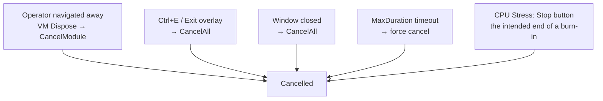

# Status Vocabulary

`TestStatus` in `Core/IModuleMetadata.cs`. Eight members, copied from architecture
§4's table and never calibrated against the code that would produce them.

**Read this before touching any module's terminal status.** The vocabulary is the
single most incoherent thing in the product, and every reporting fix depends on
settling it.

## What is actually produced

| Status | Produced by | Notes |
|---|---|---|
| `NotRun` | default only | session-level when nothing has completed |
| `Running` | orchestrator, at start | visible in a mid-run export |
| `Passed` | all five modules | |
| `Failed` | keyboard/mouse/monitor `FlagDefect`; CPU worker throw; orchestrator `Start` threw | |
| `Warning` | **only two sites**: keyboard confirm-with-untested-keys, System Info collection threw | |
| `Cancelled` | all five modules, plus three orchestrator paths | overloaded, see below |
| `Skipped` | **never assigned** | read only, in the aggregation `All(… or Skipped)` |
| `Unsupported` | **never assigned** | read only, in aggregation, a CSS map, and one UI string |

Verified by grep: `TestStatus.Skipped` and `TestStatus.Unsupported` have **zero write
sites** in the solution.

`Skipped`'s doc comment — *"The operator or timeout budget chose not to run it"* —
describes a feature that does not exist. There is no skip affordance in any view, and
the timeout produces `Cancelled`. `Unsupported` is stranger still: the one capability
that genuinely can be absent, DDC/CI, **deliberately resolves to `Passed`** because
the monitor can still pass on visual confirmation. So the app's honest-unavailable
state exists as prose in a finding and never as a status.

## `Cancelled` means five unrelated things



Three of these five share the identical finding `"Cancelled by operator."` Only the
timeout is distinguishable, and only by prose.

The worst case is **E**: pressing **Stop** on the CPU stress test is a normal,
intended action, and a deliberate 30-second smoke test is recorded exactly like an
abandoned run.

Open decision [D1](../plans/open-decisions.md) settles this.

## `Warning` and `Failed` are each two things

- **`Warning`** = "the operator confirmed a keyboard with untested keys" *or*
  "WMI inventory collection threw". Both render the same orange.
- **`Failed`** = "a real hardware defect the operator flagged" *or* "our application
  threw an exception". A reader cannot tell which. Made worse by the fact that the
  operator cannot attach a defect description (roadmap C4), so a genuine hardware
  failure and an internal fault can read almost identically.

## Session aggregation hides the audit's shape

```csharp
if      (Any(Failed))                 OverallStatus = Failed;
else if (Any(Warning or Unsupported)) OverallStatus = Warning;
else if (Any(Cancelled))              OverallStatus = Cancelled;
else if (All(Passed or Skipped))      OverallStatus = Passed;
else                                  OverallStatus = NotRun;   // unreachable
```

Only modules with `CompletedAt` set participate. Two consequences:

1. **One early-stopped burn-in turns an otherwise clean five-module audit into
   `Cancelled`**, with no counts anywhere to qualify it.
2. **`OverallStatus` describes what ran, not what should have run.** A session where
   only System Info auto-ran aggregates to `Passed`. Combined with the template
   omitting unstarted modules, that is how an unaudited machine gets a green report.

The final `else` requires a completed result whose status is `Running` or `NotRun`,
which no completion path can produce — dead code.

## Also dead

`MouseTestModuleViewModel` has a `TestStatus.Warning` display arm, but the mouse
module never emits `Warning`. `MonitorTestModuleViewModel` has a
`TestStatus.Unsupported` arm — `"Unsupported on this hardware."` — which no code path
can reach.

## Colour vocabulary

`HtmlReportTemplate.StatusClass` maps eight statuses onto five classes:

| Class | Statuses |
|---|---|
| `pass` | `Passed` |
| `fail` | `Failed` |
| `warn` | `Warning`, `Unsupported` |
| `cancel` | `Cancelled` |
| `na` | `NotRun`, `Running`, `Skipped` |

`Running` sharing grey with `NotRun` means a module still running at export time
looks like one that was never started.

## Planned direction

1. **A6** — delete `Skipped` and `Unsupported` (or produce them). An enum member with
   no write site is a promise the product does not keep.
2. **B1/D1** — decide what leaving means, then either narrow `Cancelled` or split it.
3. **C3** — map statuses to display names in a report DTO so `NotRun` never reaches a
   reader.
4. **C5** — separate operator-attested verdicts from internal faults so `Failed`
   stops meaning two things.

## Rule for new code

**Do not add a `TestStatus` member without a write site, and do not add a write site
whose meaning overlaps an existing member.** The current state is the direct result
of transcribing a specification table instead of deciding what a reader needs.
