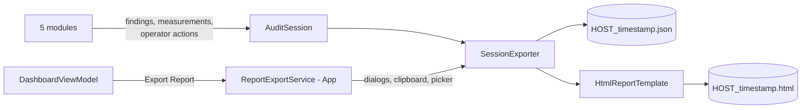

# Reporting Summary

**The report is the product.** Everything else exists to produce it. A technician
runs five tests and hands over two files that someone with no access to the machine
must be able to trust.

This is also the least-designed layer in the codebase and the focus of roadmap
Pass C.

## The pipeline



| File | Topic |
|---|---|
| [`session-model.md`](session-model.md) | `AuditSession` / `ModuleResult` / `ModuleMeasurement`, the JSON contract |
| [`export-cascade.md`](export-cascade.md) | The §9.6 write-path fallback and its App-side seam |
| [`html-report.md`](html-report.md) | Template structure and what leaks into it |
| [`status-vocabulary.md`](status-vocabulary.md) | What each `TestStatus` actually means |

## Design invariants that hold

- **Pure Core, Windows in App.** `SessionExporter` has no UI and no Win32; the
  folder picker and clipboard modal are injected as delegates via
  `ReportExportOptions`. This keeps the cascade unit-testable.
- **The session stays in memory until a write succeeds.** A failure partway down
  the cascade delays the export; it never loses the audit.
- **Probe before writing.** Each candidate directory gets a throwaway write-test
  first, so a pulled USB stick is caught while the data is still safe.
- **Everything is HTML-encoded.** All interpolation goes through
  `WebUtility.HtmlEncode`, so a hostile hostname or finding cannot inject markup.
- **Statuses serialise as strings**, not integers — `JsonStringEnumConverter` on
  `TestStatus` — so the JSON stays readable and stable across enum reordering.

## Defects that matter, in order

| # | Defect | Fix |
|---|---|---|
| 1 | **A partial audit can read `Passed`.** Only *started* modules appear, so a session where just System Info auto-ran exports green with no mention of the four untested devices. | C2 |
| 2 | **Every first export says "in progress."** `CompletedAt` is stamped after serialisation, so the HTML says `Completed: in progress` and the JSON has `"completedAt": null`. | C1 |
| 3 | **Re-export silently overwrites.** The filename derives from `StartedAt`, not export time. | C1 |
| 4 | **The operator cannot describe a defect.** Every failure reads identically. | C4 |
| 5 | **Engineering vocabulary reaches the reader.** Raw enum names, internal context tags, exception type names, thread priorities. | C3/C5 |
| 6 | **Failure is invisible.** The dashboard only shows the result dialog on success, so a hard failure shows the operator nothing. | C6 |
| 7 | **Almost no tests.** One test with four `Contains` assertions covers the entire template. | C8 |

The former "three template sections can never render" defect is cleared: `Notes` and
`Artifacts` were removed (A7) and `MachineId` is populated by the System Info module.

## What a reader gets today

An empty session — one click from launch, since Export is always enabled — produces
a fully-named, official-looking file pair containing:

```
Hardware Audit Report
Host: WS-01   Session: 8f3c…   Started: 2026-08-28 09:50:08Z   Completed: in progress
Overall status: NotRun
Modules
| No modules were run in this session. |
```

The empty-state sentence is the one deliberate empty-state string in the codebase.
But the framing is otherwise identical to a completed audit: same title, same
header, same table chrome. It reads as a blank form with a filled-in letterhead.

## Rules for changing this layer

1. **Never widen the gap between what the operator saw and what the reader gets.**
   The System Info module already shows two fields on screen that never reach the
   report; do not add a third.
2. **A reader must be able to tell what was *not* tested.** Absence of a module
   from the document currently looks identical to the tool not having that test.
3. **Add golden files before changing wording.** There is no other guard against
   drift.
4. **Internal diagnostics go to `IDiagnosticLog`, not `Findings`.**
