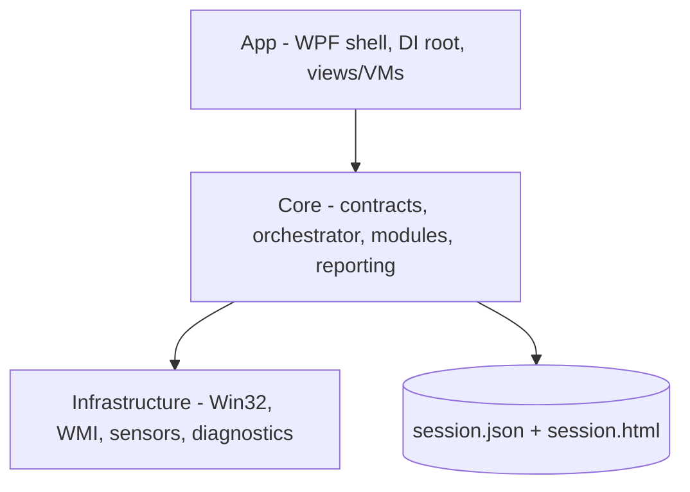

# Lode Summary

**Hardware Audit Toolkit** is a portable .NET 8 WPF application a technician runs
from a USB stick on an unfamiliar Windows machine to verify its keyboard, mouse,
monitor, CPU and inventory, then export a JSON + HTML audit report someone else
will read later. It requires no installer, no elevation, no database and no
network. Five test modules (`keyboard`, `mouse`, `monitor`, `system`, `stress`)
implement a common `ITestModule` contract, are discovered through DI, and are
coordinated by a single `TestOrchestrator` that enforces one-exclusive-module-at-a-time
and records a `TestStatus` per run into an `AuditSession`. The solution now builds
cleanly and the xUnit suite is green with **79 tests passing**. Roadmap Phases 1–4 have landed:
no checkpoint store, **leaving a test is a non-event** (only Ctrl+E / Exit Test
aborts and records `Cancelled`; CPU-stress Stop records `Passed` with the achieved
duration), **the operator is authoritative** (coverage is a measurement, never a
verdict), and the coherence cleanup is done (metadata-driven dashboard +
`ModuleScreenRegistry`, persistent Back/Export/Exit header, per-module status on
dashboard cards, `schemaVersion: 1` in the JSON). Remaining work is the manual
Phase 5 pre-ship checklist and the owner-deferred v2 list.

## The two principles that actually hold

These are the product's real point of view, applied without exception. Preserve
them through any refactor.

1. **Never trap the operator** (architecture §6). Every screen has a mouse-only
   *and* a keyboard-only exit, independently sufficient. See
   [`architecture/exit-and-navigation.md`](architecture/exit-and-navigation.md).
2. **Degrade honestly, never crash** (architecture §9.7). A failing hardware call
   becomes an "unavailable" reading, not an exception; a throwing background loop
   becomes `Failed`, not a dead process. See
   [`architecture/fault-containment.md`](architecture/fault-containment.md).

## The three questions that were open — now answered

All three open decisions were answered by the owner on 2026-08-31 and are
binding; see [`plans/open-decisions.md`](plans/open-decisions.md) (§"Resolved")
and [`plans/roadmap.md`](plans/roadmap.md) for the implementation phases:

- **Leaving a test is a non-event** — it records nothing; only Ctrl+E aborts.
- **The operator is authoritative** — coverage is a measurement, never a verdict.
- **No crash recovery** — the write-only checkpoint store is deleted.

## Current shape

- **App** owns the composition root (`App.xaml.cs:169-238`), the shell, and all
  Windows interactions.
- **Core** owns the contracts, the orchestrator, the five modules, and reporting.
  No UI, no directly-authored P/Invoke.
- **Infrastructure** owns every Win32/WMI/sensor call, always behind an interface,
  always best-effort.

## Current reporting invariants

The export cascade is resilient: invalid preferred folders are treated as
non-fatal, the exporter falls back to the next valid location or clipboard, and
the JSON payload is generated once per export attempt before the file-write
decision. The write flow keeps the JSON and HTML pair aligned for the same
resolved export target instead of letting a later path selection drift from the
serialized model.

## Where to start reading

| I need to… | Read |
|---|---|
| Understand the layers and DI wiring | [`architecture/summary.md`](architecture/summary.md) |
| Change how a test starts, stops or is recorded | [`architecture/orchestrator.md`](architecture/orchestrator.md) |
| Touch a specific test | [`modules/summary.md`](modules/summary.md) |
| Change what the technician receives | [`reporting/summary.md`](reporting/summary.md) |
| Understand why a status means what it means | [`reporting/status-vocabulary.md`](reporting/status-vocabulary.md) |
| Add or fix a hardware call | [`infrastructure/summary.md`](infrastructure/summary.md) |
| Know the house style before writing code | [`practices.md`](practices.md) |
| Know what to work on next | [`plans/roadmap.md`](plans/roadmap.md) |
