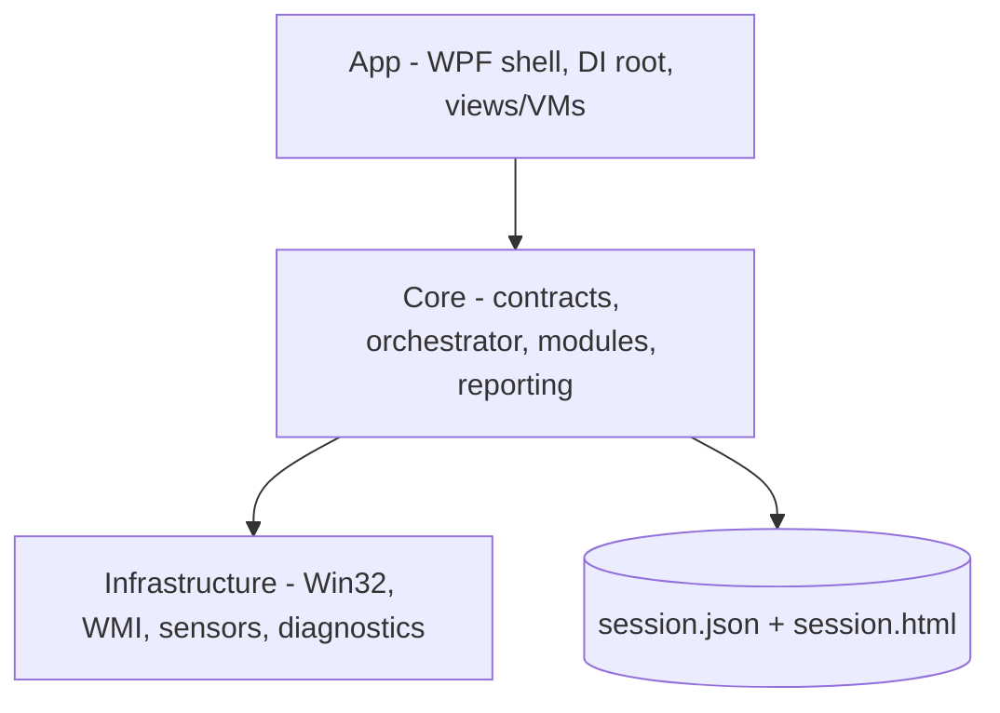

# Lode Summary

**Hardware Audit Toolkit** is a portable .NET 8 WPF application a technician runs
from a USB stick on an unfamiliar Windows machine to verify its keyboard, mouse,
monitor, CPU and inventory, then export a JSON + HTML audit report someone else
will read later. It requires no installer, no elevation, no database and no
network. Five test modules (`keyboard`, `mouse`, `monitor`, `system`, `stress`)
implement a common `ITestModule` contract, are discovered through DI, and are
coordinated by a single `TestOrchestrator` that enforces one-exclusive-module-at-a-time
and records a `TestStatus` per run into an `AuditSession`. The build is clean
(zero warnings) with **61 xunit tests passing**. All feature work described in the
architecture document is implemented; the outstanding work is not new features but
**correcting the report layer, the status vocabulary and the exit semantics**, all
catalogued in [`../taste-audit.md`](../taste-audit.md) and planned in
[`plans/roadmap.md`](plans/roadmap.md).

## The two principles that actually hold

These are the product's real point of view, applied without exception. Preserve
them through any refactor.

1. **Never trap the operator** (architecture §6). Every screen has a mouse-only
   *and* a keyboard-only exit, independently sufficient. See
   [`architecture/exit-and-navigation.md`](architecture/exit-and-navigation.md).
2. **Degrade honestly, never crash** (architecture §9.7). A failing hardware call
   becomes an "unavailable" reading, not an exception; a throwing background loop
   becomes `Failed`, not a dead process. See
   [`architecture/fault-containment.md`](architecture/fault-containment.md).

## The two questions that were never answered

Both block implementation work and need the human's decision. Recorded in
[`plans/open-decisions.md`](plans/open-decisions.md).

- **What does leaving a test mean?** Every exit path currently records `Cancelled`,
  conflating "looked and moved on" with "aborted" and with "deliberately stopped
  the burn-in early".
- **Is operator judgment authoritative, or is coverage?** The keyboard module
  overrides the operator with `Warning`; the mouse module passes on zero evidence.
  One answer must apply to both.

## Current shape

- **App** owns the composition root (`App.xaml.cs:169-238`), the shell, and all
  Windows interactions.
- **Core** owns the contracts, the orchestrator, the five modules, and reporting.
  No UI, no directly-authored P/Invoke.
- **Infrastructure** owns every Win32/WMI/sensor call, always behind an interface,
  always best-effort.

## Where to start reading

| I need to… | Read |
|---|---|
| Understand the layers and DI wiring | [`architecture/summary.md`](architecture/summary.md) |
| Change how a test starts, stops or is recorded | [`architecture/orchestrator.md`](architecture/orchestrator.md) |
| Touch a specific test | [`modules/summary.md`](modules/summary.md) |
| Change what the technician receives | [`reporting/summary.md`](reporting/summary.md) |
| Understand why a status means what it means | [`reporting/status-vocabulary.md`](reporting/status-vocabulary.md) |
| Add or fix a hardware call | [`infrastructure/summary.md`](infrastructure/summary.md) |
| Know the house style before writing code | [`practices.md`](practices.md) |
| Know what to work on next | [`plans/roadmap.md`](plans/roadmap.md) |
